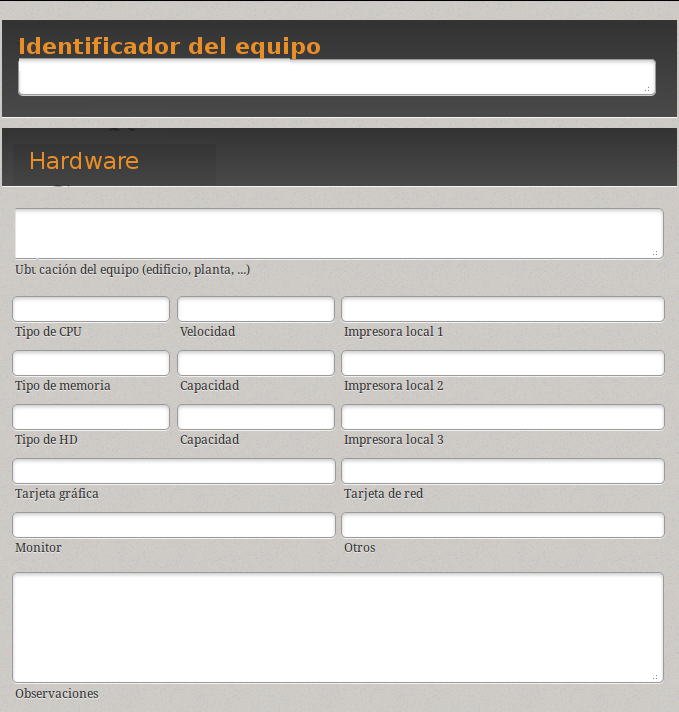
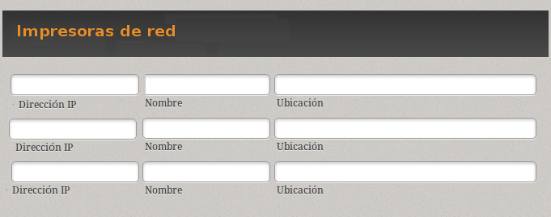
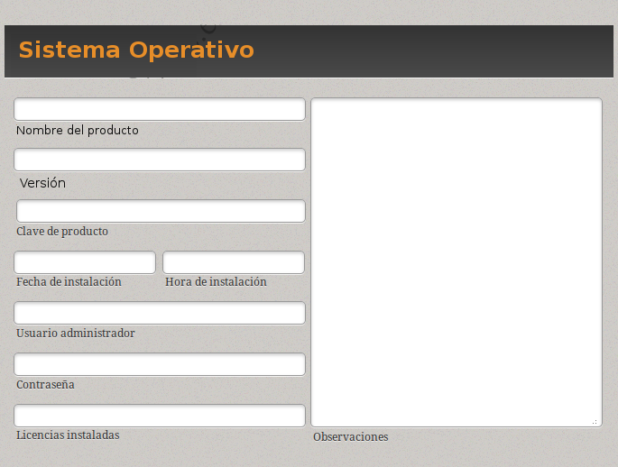
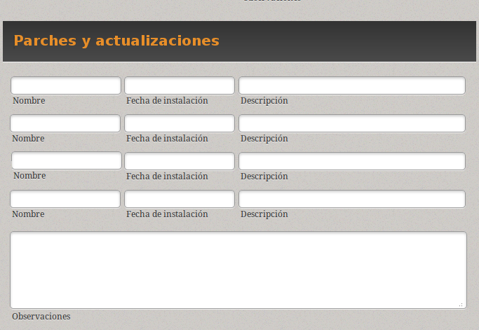
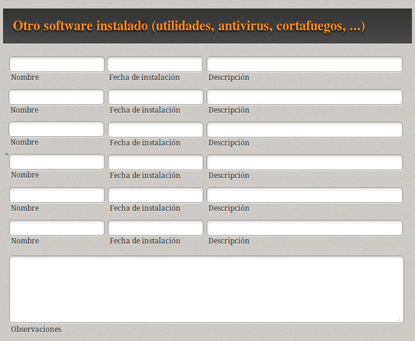
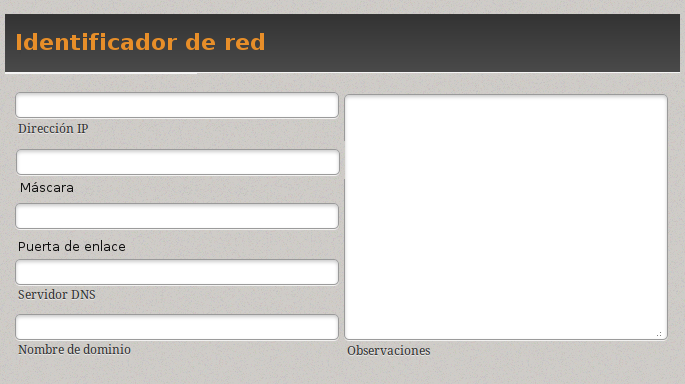
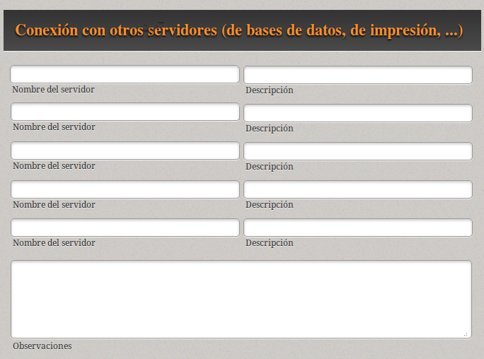

# 2.1 Documentación de los procesos de instalación

## Elaboración de la documentación sobre la instalación e incidencias

Uno de los aspectos que más se descuidan cuando se procede a implantar una infraestructura *cliente* es la documentación del proceso. Sin embargo, debemos pensar que un sistema operativo es algo vivo que irá creciendo y adaptándose a las necesidades del entorno en el que se encuentra. Por este motivo, no debemos pensar en la instalación como algo que haremos una vez y de lo que nos podemos olvidar, sino que realizaremos diferentes modificaciones a lo largo del tiempo.

De lo dicho anteriormente, se puede deducir que, cuanto mas precisa sea la documentación que generemos, menos problemas tendremos para retomar el trabajo de instalación o configuración un tiempo después de haberlo dado por concluido.

En este sentido, una de las primeras cuestiones a las que debemos enfrentarnos es a la nomenclatura. Es buena idea asignar a cada equipo de nuestra red un identificativo único, que puede estar relacionado, por ejemplo, con la función que realiza, su ubicación dentro de la empresa, área en la que se emplea, etc. El objetivo es poder referirnos a cada elemento de la red de una forma abreviada y cómoda. Por ejemplo, un servidor podría tener asignado un identificador como CLI01-INF (Cliente nº 1 del departamento de Informática).

La idea es disponer de un documento con el perfil de la instalación para cada uno de los equipos incluidos en nuestra infraestructura (sean servidores o no).

En este sentido, cada uno de estos documentos debería tener, además del identificador, los siguientes datos:

* ***Datos de hardware*:** Deberán describir, de una forma precisa, las características del ordenador que estamos definiendo. Incluirá su ubicación, el tipo de procesador que incorpora, el tipo y cantidad de memoria, su disco duro, su tarjeta de red, tarjeta gráfica, etc. También debemos dejar constancia de los dispositivos conectados al ordenador, como impresoras, faxes, escáneres, etc.

**1. Identificador del equipo**

* Datos sobre las impresoras de red que estarán accesibles desde el equipo. Al menos deberemos contemplar su dirección IP, su nombre y su ubicación física.

**2.Impresoras en red**

* La descripción del sistema operativo instalado. Debe ser lo más detallada posible y, como mínimo, incluirá su nombre y versión, la fecha y la hora de instalación, el usuario que actúa como administrador y su contraseña, las licencias instaladas, etc. Cuando instalamos sistemas operativo privativos, como es el caso de Windows, un dato que no siempre se incluye en la documentación, pero que es muy importante para futuras operaciones de actualización es la clave de producto (Product Key, en inglés). Se trata de la secuencia de números y letras, normalmente organizadas en grupos y separadas por guiones, que suele venir adherida al embalaje del medio de almacenamiento en el que se distribuye el producto.

**3. Descripción del Sistema Operativo instalado**

* ***Parches* y *actualizaciones* que se hayan instalado:** Anotaremos el nombre de cada parche o actualización que instalemos en el sistema operativo, con la fecha de la instalación y una descripción de su objetivo.

**4. Parches y actualizaciones**

* Si instalamos cualquier programa *complementario*, como antivirus, cortafuegos, programa de cifrado, etc., deberemos dejar constancia de ello, indicando el nombre del programa (preferiblemente con la versión), la fecha en la que lo hemos instalado y una descripción.

**5. Otro software instalado**

* Otro aspecto que será muy importante documentar es la ***configuración de la red*.** Es frecuente que los clientes dispongan de una dirección *IP dinámica (en algunos casos puede ser estática)*, por lo que procederemos a anotar dicha dirección IP y máscara de subred, así como la puerta de enlace, el servidor DNS que estamos utilizando y, en su caso, el nombre del dominio o grupo de trabajo en el que se integra el equipo.

**6. Configuración de la red**

* Es común que un equipo cliente se conecte a algún servidor de la red para autentificarse, acceder a ficheros, etc.. (por ejemplo, servidores de datos o servidores de impresión). Por lo tanto, anotaremos qué servidores se utilizan y describiremos los motivos.

**7. Conexión a servidores**

Es importante que pensemos en este documento como algo orientativo, que deberá adecuarse a las características de la instalación concreta que se esté realizando, incluyendo o eliminando cualquier dato necesario.

Además, aunque no lo hemos dicho de forma expresa, podría deducirse que hemos hablado de un documento impreso en papel. Sin embargo, sería interesante contemplar la posibilidad de convertirlo en un documento electrónico de forma que, por ejemplo, toda la información de la implementación esté, en realidad, contenida en una base de datos.

Con el fin de que la explicación sea más clara, se ha ido fragmentando en diferentes apartados, pero no debemos olvidar que se tratará de un documento único, que en nuestro caso tendrá que ser algún artefacto TIC, a saber:

* Hoja de cálculo en Google Docs compartida con el profesor.
* Base de datos (Base): Formularios para la entrada de datos y exportación a report.
