# 2.2 Proceso de arranque de un sistema operativo

El ***hardware***, por si solo es totalmente incapaz de realizar ninguna acción, necesita un software que le indique que tiene que hacer. Cuando encendemos un sistema informático, estamos poniendo en marcha ***hardware***, por lo que se necesitan medios especiales para hacer que se cargue un primer software.

## 2.2.1 El sector de arranque

En el ***sector de arranque*** se almacena tanto la tabla de particiones como la partición desde la cual se debe inicializar el sistema operativo. Si el sector de arranque se daña, puede perderse o bien la tabla de particiones (quedando inaccesible la información del disco), el gestor de arranque o ambos. Afortunadamente existen herramientas que permiten reconstruir la tabla de particiones y el gestor de arranque.

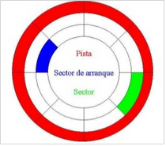

***Figura 2.1.1.** Estructura de un disco.*

Para instalar Windows 10/11 en modo UEFI con Secure Boot activado se utiliza particionado GPT y tanto la BIOS como el disco o medio de instalación deberán estar configurados para UEFI.

## 2.2.2 Proceso de arranque

### 1. Introducción

Una de las cuestiones más importantes a la hora de instalar sistemas operativos en una máquina es controlar el arranque del sistema.

### 2. La BIOS/UEFI

#### 2.1. BIOS

La BIOS es un componente de la placa base que controla la máquina durante las primeras fases del arranque, concretamente el POST.

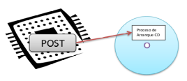

***Figura 1.** Post - proceso de arranque.*

Desde el punto de vista práctico, el programa de configuración de la BIOS se utiliza para decidir el orden de los dispositivos desde los que se puede arrancar el sistema.

La ***BIOS*** es un ***sistema anticuado***, sin cambio desde la aparición de los primeros IBM PC a principios de la década de los 80. En la actualidad se está produciendo el cambio a la nueva tecnología denominada UEFI.

Desde la aparición de de Windows 8, Microsoft obliga a los fabricantes a implantar UEFI en sus placas base para certificarlas. Con anterioridad, existía un problema de compatibilidad con los sistemas de 32 bits de la compañía y esta tecnología, por lo que no era admitida en Windows Vista o 7 (versiones de 32 bits).

#### 2.2. UEFI

UEFI (Unified Extensible Firmware Interface) es una interfaz estándar impulsada por la mayoría de fabricantes de PC y diseñada para reemplazar la histórica BIOS de IBM. Es mucho mas amigable que la BIOS tradicional, soporta un entorno gráfico de mayor calidad, multilenguaje, pre-carga de aplicaciones, gestión LAN, etc.

No se limita a arquitecturas de 32 bits sino que también puede manejar arquitecturas de 64 bit, permitiendo que las aplicaciones en pre-boot puedan direccionar 64 bits. Una de sus características principales es la posibilidad de ser ampliado (extensible) usando extensiones del fabricante.

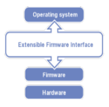

***Figura 2.** Estratos UEFI.*

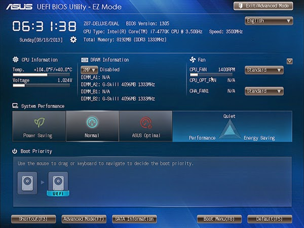

***Figura 3.** Ejemplo de UEFI.*

Las principales mejoras respecto a BIOS son:

* Inicios más rápidos.
* Al usar particiones GPT (GUID Partition Table) en lugar del clásico MBR1, se supera la limitación de 4 particiones y discos de más de 2TB.
* Se permiten 128 particiones por disco de un máximo de 18 EB cada una.
* El acceso a todos los recursos del sistema permite utilidades de configuración más completas.
* Aumento de velocidades de transferencia sobre todo de múltiples archivos.
* Compatible con controladores de dispositivos modernos (firmware 64 bits).
* SecureBoot (protección del inicio frente a bootkits).

Un ***bootkit*** es un programa malicioso que infecta el MBR. Es difícil de detectar porque su código esta fuera del sistema de archivos del Sistema Operativo. Además algunos bootkits esconden al MBR infectado devolviendo un MBR limpio cuando se intenta leer esta zona. El objetivo final es infectar el Sistema dirigiendo su ataque sobre el o sobre ciertas aplicaciones con fines variados, malware, agujeros de seguridad, ...

##### 2.2.1 Instalaciones UEFI. Consideraciones

* En Bios UEFI solo podemos instalar Sistemas Operativos de 64 bits.
* No se puede instalar un Sistema Operativo desde un Pendrive en modo UEFI, excepto que la BIOS permita arranque USB en modo UEFI y casi ninguna lo hace.
* El disco donde instalemos tiene que ser GPT (no MBR).
* Requiere una partición adicional para el Boot.

**MBR:** El Master Boot Recrod, es un registro de arranque principal, conocido también como registro de arranque maestro.

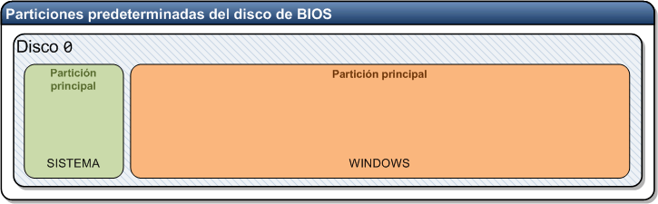

***Figura 4.** Particiones predeterminadas del disco de BIOS.*

***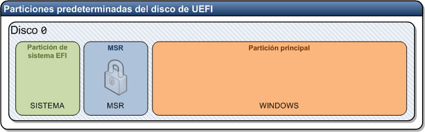***

***Figura 5.** Particiones predeterminadas del disco de UEFI.*

La mayor parte de las BIOS nuevas tienen los dos modos:

* Legacy Mode (Bios normal).
* UEFI Mode.

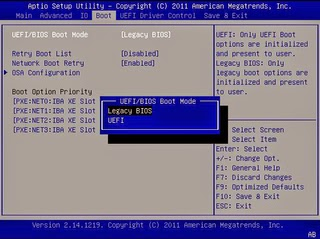  
***Figura 6.** Ejemplo en BIOS AMI.*

Para instalar Windows 10/11 en modo UEFI con Secure Boot activado se utiliza particionado GPT y tanto la BIOS como el disco o medio de instalación deberán estar configurados para UEFI.

##### 2.2.2 Secure Boot

Se trata de un firmware propio de UEFI embebido en la máquina que exige que el Sistema Operativo y sus drivers estén firmados digitalmente y que dicha firma concuerde con el firmware embebido. Microsoft implementa en la propia arquitectura de su nuevo Windows 8, el arranque seguro obligando a que el Sistema Operativo y sus drivers estén firmados digitalmente. Además para que los equipos comercializados con Windows 8 puedan tener la pegatina oficial tienen que implementar arranque seguro UEFI.

Según Microsoft en la configuración del firmware se incluye una opción para que sea el usuario el que decida desactivar esta opción, pero si los fabricantes se sienten presionados por el gigante sería muy fácil dejar de incluir esa opción con tal de poder seguir vendiendo máquinas con la pegatina oficial de Microsoft y las repercusiones de esto podrían ser bastante nefastas para el usuario final, que con la excusa de la seguridad podría tener serios problemas para bootear un USB o un DVD con un Sistema Operativo no certificado, por poner un ejemplo Windows 7 o las distribuciones Linux.

* ¿Estaría garantizado poder instalar el Sistema Operativo que el usuario decidiese?
* ¿Que ocurriría con los equipos a medio plazo?
* ¿Quien sería la autoridad de certificación central para firmar otros Sistemas Operativos?
* ¿El resto de Sistemas Operativos tendrían que negociar con Microsoft?

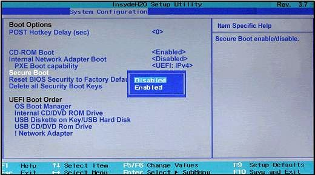

***Figura 7.** Opción Secure Boot.*

### 3. GPT vs MBR

El sistema **GPT** se creó para UEFI con la idea de modernizar el proceso de arranque. **GPT** puede manejar discos mayores de 2TB y permite una cantidad teórica ilimitada de particiones.

Ofrece muchas ventajas para servidores que usan sistemas avanzados que requieren grandes cantidades de espacio.

El problema es que un disco duro no puede tener particiones de ambos tipos y la solución pasa por eliminar la partición GPT, sin embargo el administrador de discos o el instalador de Windows no las eliminan y habrá que recurrir a la consola de Windows para su borrado o bien a través de utilidades externas.

## 2.2.3 Elección y arranque del Sistema Operativo

Desde la BIOS vemos cómo podemos indicar de qué dispositivo queremos arrancar. Podemos indicar normalmente si queremos arrancar desde el disco duro, desde el CD, USB, etc.

Hay BIOS desde donde se puede indicar incluso desde cuál de los discos duros queremos arrancar (HDD- 0, HDD-1, etc.) Hay que tener en cuenta que en algunas BIOS esta facilidad para distinguir entre los distintos discos duros no está presente, o no funciona bien. En los casos en que esto ocurra, tendremos que introducirnos en la BIOS y desactivar los discos duros de los que no queremos que arranque. Así, por ejemplo, en un sistema informático de dos discos duros si queremos arrancar desde el primer disco duro no tenemos que hacer nada pero si queremos arrancar desde el segundo disco duro desactivaremos el primero en la BIOS.

Para desactivar los discos duros, hay que entrar en la primera opción de la BIOS y poner None, not instaled, o algo parecido en el tipo de disco duro que queremos desactivar. Esto no quiere decir que dichos discos duros no se usarán durante el funcionamiento normal de la máquina, sino que no se usarán en el proceso de arranque.

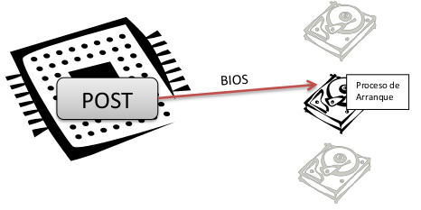

***Figura 1.** Proceso de selección disco de arranque.*

Pero con esto conseguimos indicar al sistema informático que disco duro quiero utilizar para el arranque del sistema... pero resulta que en un solo disco duro puedo tener instalado más de un sistema operativo.

***¿Cómo se le indica al sistema que quiero arrancar con Windows 7, Windows 10, o GNU/Linux si todos estos Sistemas Operativos están instalados en el mismo disco duro?***

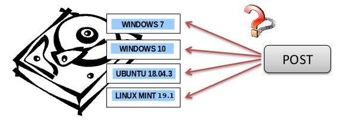

***Figura 2.** Proceso de selección de Sistema Operativo.*

Para entender esto tenemos que comprender bien como está organizado un disco duro y esto, lo vemos en el ***capítulo 6.2.4***.

## 2.2.4 Organización lógica del disco duro

### 1. Introducción

Vamos a ver cómo se organiza un disco duro a alto nivel, donde las particiones, son divisiones lógicas efectuadas en el disco duro. Estas particiones responden a una necesidad muy importante en informática: compartir un mismo disco duro para varios sistemas operativos o varios espacios de almacenamiento.

Cada partición tiene la estructura lógica correspondiente a su sistema operativo, ejemplo: El diseño de partición predeterminado para las PC's basados en UEFI es:

* Una partición del sistema.
* Un MSR.
* Una partición de Windows.
* Una partición de herramientas de recuperación.

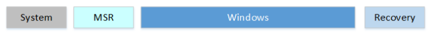

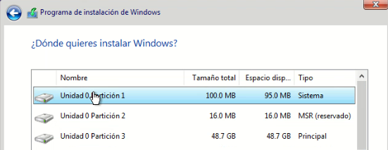

***Figura 1.** Esquema de particionado en sistema UEFI con Windows 10.*

[Fuente msdn Microsoft](https://docs.microsoft.com/es-es/windows-hardware/manufacture/desktop/configure-uefigpt-based-hard-drive-partitions?redirectedfrom=MSDN)

### 2. Disco MBR

En un disco duro [***MBR/ms-dos***](https://es.wikipedia.org/wiki/Registro_de_arranque_principal) se pueden configurar hasta 4 particiones primarias/extendidas como máximo. De las 4, solo una puede estar definida como activa al mismo tiempo. Esta partición activa será la que cargue el sistema operativo cuando se inicia el sistema informático.

El primer sector de cada una de estas particiones se conoce como sector de arranque, y en dicho sector (512 bytes) se almacena un programa especial que es el encargado de arrancar el sistema operativo de dicha partición.

En el primer sector del disco duro no se sitúa un sector de arranque, en su lugar se sitúa una tabla de particiones (Master Boot Record o MBR). Esta tabla de particiones incluye una tabla donde se definen las 4 particiones que pueden estar presentes en el disco duro y su tamaño y un pequeño programa que permite localizar la partición activa, leer su sector de arranque y usarlo para arrancar el sistema informático.

Este MBR (Master Boot Record) está situado en el primer sector del disco duro, de modo que su tamaño es de 512 bytes. En esta capacidad se almacena lo siguiente por cada MBR:

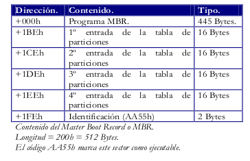

***Figura 2.** Contenido del MBR.*

Figura 5. Particiones GPT en GNU/Linux (6 particiones).

**MBR**: El Master Boot Recrod, es un registro de arranque principal, conocido también como registro de arranque maestro. Es el primer sector ("sector cero") de un dispositivo de almacenamiento de datos, como un disco duro. En ocasiones, se emplea para el arranque del Sistema Operativo con bootstrap, otras veces es usado para almacenar una tabla de particiones y, en ocasiones, se usa sólo para identificar un dispositivo de disco individual, aunque en algunas máquinas esto último no se usa y es ignorado.

Vemos como existe un programa al principio conocido como programa **MBR** que ocupa 445 Bytes. Un programa MBR estándar leerá la tabla de particiones y escogerá de cuál de esas particiones va a arrancar el sistema operativo. No lo hará como podría parecer lógico de la primera partición, sino de la partición primaria que está marcada como activa. El MBR lee el primer sector de esa partición, y le cede el control de la CPU a ese programa (Boot Sector o Sector de Arranque).

Hay que indicar que no existe un programa MBR estándar. En realidad, el código que se encuentra aquí, puede ser muy variado, aunque normalmente todos son compatibles. Podemos instalar programas MBR conocidos como gestores de arranque que amplían las posibilidades el gestor de arranque MBR instalado por defecto.

Si se arranca desde un disco duro, se lee el primer sector (MBR) y este a su vez, lee un segundo sector (Boot Sector). Vemos también como existen 4 entradas para almacenar hasta 4 particiones, de aquí viene el límite de 4 particiones para un disco duro. También vemos como por cada partición se almacena su tipo con 16 bytes. En estos 16 bytes se almacena lo siguiente:

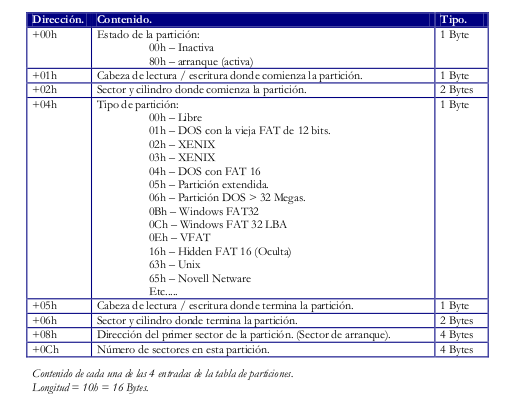

***Figura 3.** Contenido de cada partición.*

* Vemos como el 1er campo se usa para indicar si esta partición es la activa o no.
* El 2º y 3er campo se usan para indicar el cilindro, sector y cabeza donde comienza la partición.
* El 4º campo se usa para almacenar el tipo de la partición, aquí se indica que sistema operativo esta instalado en la partición, si dicha partición esta oculta o no, etc.
* El 5º y 6º campo se usan para indicar el cilindro, sector y cabeza donde termina la partición.
* El 7º campo indica la dirección del primer sector de la partición (el sector de arranque) para que el POST pueda pasarle el control. Este sector siempre es el 1o sector de la partición, pero aquí indicamos su valor director (no de sector) y no la combinación cilindro, sector y cabeza. Esto se hace para que el acceso al sector de arranque sea más rápido, y para evitar posibles errores en la carga del sistema.
* El 8º campo se usa para almacenar el número total de sectores que existen en la partición. Es un campo que se usa para comprobar que los datos de la partición son correctos.

### 3. Disco GPT

Los ***discos GPT*** (GUID Partition Table) surgen para reemplazar al MBR y están asociados con los nuevos sistemas UEFI. Su nombre viene de que a cada partición se le asocia un único identificador global (GUID), un identificador aleatorio tan largo que cada partición en el mundo podría tener su ID único, ejemplo: UUID=e6494a9b-5fb6-4c35-ad4c-86e223040a70.

A día de hoy, **GPT** no tiene ningún límite más allá que los que establezcan los propios sistemas operativos, tanto en tamaño como en número de particiones (por ejemplo, Windows tiene un límite de 128 particiones).

Las ventajas que ofrecen respecto a MBR son las siguientes:

1. No tiene la limitación de las 4 particiones primarias/extendidas que tienen los discos MBR. La limitación depende del sistema operativo.
2. Admite particiones superiores a los 2TB.
3. La fiabilidad de los discos GPT es mucho mayor que la de MBR. Mientas que en MBR la tabla de particiones se almacena solo en los primeros sectores del disco, GPT crea múltiples copias redundantes a lo largo de todo el disco de manera que, en caso de fallo, problema o error, la tabla de particiones se recupera automáticamente desde cualquiera de dichas copias, por lo que ***GPT tiene tolerancia a fallos*** al mantener copias de la tabla de particiones en el primer y último sector del disco.

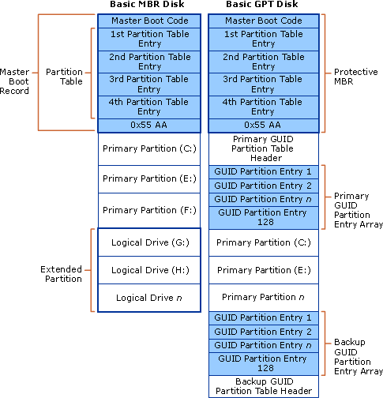

***Figura 4.** Comparativa MBR vs GPT.*

Los sistemas operativos Windows solo puede arrancar desde discos GPT en sus versiones de 64 bits (desde Vista en adelante). Los sistemas de 32 bits, aunque no pueden arrancar desde estos discos, sí que son capaces de leer y escribir en ellos sin problemas.

Las distribuciones actuales de GNU/Linux también son compatibles con este tipo de discos, e incluso Apple ha empezado a utilizar GPT como tabla de particiones por defecto en lugar de su propia APT (Apple Partition Table).

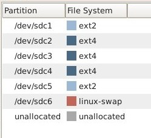

***Figura 5.** Particiones GPT en GNU/Linux (6 particiones).*

## 2.2.5 Gestores de arranque

### 1. Introducción

Cuando se intenta cargar el sistema operativo desde un disco duro, lo realiza en dos fases:

1. La primera fase consiste en cargar el programa que se ubica en la MBR o GPT del disco. Esta primera fase normalmente consiste en un menú para seleccionar la segunda fase del arranque o se pasa de forma automática a una de las particiones para efectuar la segunda fase.
2. La segunda fase es la carga de un sistema operativo concreto en memoria para que tome el control de la máquina.

En el caso del sistema operativo Linux existe un cargador de arranque bastante extendido que se denomina GRUB.

**[GRUB](https://es.wikipedia.org/wiki/GNU_GRUB)** es un administrador o gestor de arranque múltiple, desarrollado por el proyecto GNU, derivado del GRand Unified Bootloader (GRUB; en español: Gran Gestor de Arranque Unificado), que se usa comúnmente para iniciar uno de dos o más sistemas operativos instalados en un mismo equipo.

Puedes encontrar la documentación oficial de GRUB:

* <https://www.gnu.org/software/grub/grub-documentation.html>

En el siguiente [enlace](https://wiki.archlinux.org/index.php/GRUB_%28Español%29), también te puede ser de utilidad.

El **gestor de arranque de Windows** es menos versátil y solo admite elegir entre varios sistemas de Microsoft, lo que lo hace una mala elección para las máquinas con varios sistemas operativos instalados. Para manejarlo, es necesario acceder a la consola de recuperación que se encuentra en los discos de instalación de los sistemas de Microsoft.

### 2. Algunos archivos y directorios de GRUB

El **archivo principal de GRUB** es **grub.cfg** y lo encontramos en el directorio **/boot/grub**. En el propio fichero se indica que no se debe editar. Este fichero se genera de forma automática utilizando ficheros que se encuentran en el directorio **/etc/grub.d** y configuraciones del fichero**/etc/default/grub**.

### Algunos comandos útiles

Puedes ver el contenido de los directorios anteriores con el comando ls. En una terminal dentro de Ubuntu, prueba a escribir lo siguiente (Verás que ahí se encuentra el fichero grub.cfg):

**jc@jc-Latitude-E6430:~$**ls /boot/grub

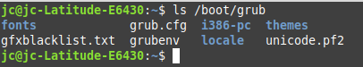

Si listas el directorio **/etc/grub.d**, verás que hay diversos ficheros. Mencionaremos el **/etc/grub.d/30\_os-prober**, que detecta sistemas operativos instalados y para ellos crea un entrada en grub.cfg para poder seleccionarlos al arrancar.

Y el fichero **/etc/grub.d/40\_custom** se puede utilizar para añadir entradas en el menú de GRUB de forma manual.

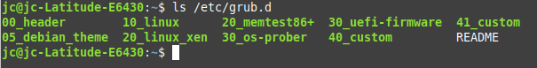

### Variables en /etc/default/grub

A continuación, vamos a ver algunas variables que se encuentran en el fichero /etc/default/grub y que vamos a modificar para personalizar GRUB. Tras realizar modificaciones en las variables, para consolidar los cambios, hay que actualizar GRUB mediante el siguiente comando:

**jc@jc-Latitude-E6430:~$**sudo update-grub

A continuación, hay que reiniciar el equipo (máquina virtual) para ver el resultado. Se pude reiniciar utilizando el comando:  
**jc@jc-Latitude-E6430:~$**shutdown -r 0

El comando **shutdown** sirve para apagar o reiniciar el equipo, según los parámetros que se utilicen. Con -r se indica reinicio, con 0 se indica que se desea que sea en el momento en que se pulse intro. Si no se pone 0, esperará un minuto para el reinicio.

Algunas de las variables que se encuentran en el fichero /etc/default/grub y que se pueden modificar son las siguientes:

* **GRUB\_DEFAULT**="Ubuntu".  Es la entrada de menú que se selecciona por defecto. Puede ser también un número (empezando a contar desde 0 para la primera entrada de menú, por ejemplo, podríamos tener GRUB\_DEFAULT="0") o puede ser la cadena especial ‘saved’. En este último caso, la entrada de menú por defecto será la guardada en GRUB\_SAVEDEFAULT.
* **GRUB\_HIDDEN\_TIMEOUT="0"** y **GRUB\_HIDDEN\_TIMEOUT\_QUIET="true"**. Las dos variables anteriores podemos comentarlas (quiere decir poner delante de cada línea el símbolo # para que sean tratadas como un comentario por el programa, no como una asignación de valor a una variable) para no tener problemas con las distintas configuraciones que haremos de la variable siguiente, GRUB\_TIMEOUT.
* **GRUB\_TIMEOUT="10".** Tiempo de espera (en segundos) antes de arrancar la entrada de menú por defecto, a menos que se haya pulsado alguna tecla. Si establecemos el valor en -1, espera indefinidamente hasta que pulsemos intro.
* **GRUB\_CMDLINE\_LINUX\_DEFAULT="quiet".** Con quiet, tras elegir el sistema, se ocultan los mensajes informativos al arrancar el sistema operativo.
* **GRUB\_BACKGROUND.**Sirve para especificar una imagen de fondo. Debe tratarse de un archivo que pueda ser leído por GRUB en el momento del arranque y debe acabar en .png, .tga, .jpg o .jpeg. La imagen será escalada si es necesario para adaptarse a la pantalla.

En el siguiente **[enlace](https://www.gnu.org/software/grub/manual/grub/grub.html#Simple-configuration)** encontraréis información detallada de estas y otras variables que se pueden utilizar en el fichero /etc/default/grub.

Una vez se modifican las variables deseadas, para consolidar los cambios hay que ejecutar:

**jc@jc-Latitude-E6430:~$**sudo update-grub
