# 2.3 Particionado de discos

Una partición de disco es una división lógica del espacio de almacenamiento. De esta manera, cada partición se vuelve independiente del resto y puede albergar diferentes cosas. Gracias a esta división, borrar el contenido de una partición no afectaría al contenido del resto de particiones. Es como si tuviéramos una zona de almacenaje (como un trastero) y, en lugar de apilar unas cajas encima de otras, colocáramos varias estanterías para organizar el espacio.

El contenido de cada estantería podría ser distinto. Incluso si un día queremos modificar la organización de una estantería el resto de estanterías no se verían afectadas.

Por lo dicho, es recomendable tener una partición por cada sistema operativo instalado (para Linux hará falta otra u otras adicionales que ya se verán más adelante) y una o varias particiones más para albergar datos.

Por ejemplo, si quisiéramos instalar Windows y Linux en un disco duro una posible elección de particiones sería la siguiente:

* 1 partición para Windows.
* 2 particiones para Linux (una para el sistema y otra de intercambio/swwap).
* 1 partición para nuestros documentos personales.
* 1 partición para nuestros ficheros personales/privados.

A las dos últimas particiones accederíamos desde Windows y Linux por lo que el sistema de ficheros tendría que ser compatible con los dos sistemas operativos. Un sistema de archivos compatible entre los sistemas Windows y Linux es **NTFS**.

## 2.3.1 Tipos de particiones

### 1. Particiones MBR (msdos)

A la hora de dar formato a un disco duro, el estilo de tablas de particiones más utilizado en la actualidad en discos menores a 2Tbytes es ***MBR***. Este estilo de formato lleva más de 30 años funcionando en la mayor parte de los Sistemas Operativos. Una de las principales limitaciones de este estilo de particiones es el tamaño máximo con el que puede trabajar: 2TBytes. Además, MBR solo puede trabajar con 4 particiones primarias, por lo que para crear más de 4, hay que recurrir a las particiones extendidas.

**1.1 El MBR**

El Registro de Arranque Principal (Master Boot Record) es el primer sector (los primeros 512 bytes) también conocido como Sector Cero de un dispositivo de almacenamiento de datos, habitualmente el disco duro. Almacena la información de arranque del disco duro, entre la que se encuentra la información necesaria para que la BIOS pueda proceder con la carga del Sistema Operativo (Tabla de particiones y Cargador de Arranque).

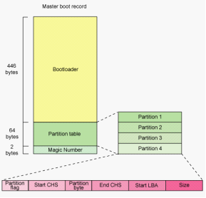

***Figura 1.** Esquema de MBR.*

Generalmente en el caso de un PC con 2 o más discos duros, el MBR con la información de arranque del sistema o sistemas, se encuentra sobre el disco duro en el que se instaló el primer Sistema Operativo. Esto no significa que los demás discos duros no tengan MBR.

#### 1.2 Estructura del MBR

* **Tabla de Particiones:** Es un conjunto de registros (tabla), en concreto 4 registros de 16 bytes ubicada al principio del MBR cuya función es definir las particiones primarias. Almacena información importante sobre las particiones: Formato, Tamaño, Sector de inicio y un Marcador que indica si es o no de arranque (sólo puede haber una partición de arranque).
* **Bootloader**: Es un programa que contiene funcionalidades rudimentarias para: buscar unidades que puedan participar en el arranque, seleccionar la unidad adecuada y cargar un pequeño código desde dicha unidad. No es un Sistema Operativo, sino un cargador de arranque capaz de cargar el SO propiamente dicho y transferirle el control. En este sentido el BootLoader es independiente del Sistema Operativo.

#### 1.3 Particiones MBR

Los *discos particionados con MBR* utilizan la BIOS estándar. Soportan particiones como máximo de 2TB, y pueden alojar un máximo de 4 particiones. Existen 3 tipos diferentes de particiones msdos (MBR):

* **Partición primaria**. Son las divisiones primarias del disco. Estas son las particiones arrancables, es decir, desde las que al encender el ordenador arrancaría el Sistema Operativo que hubiera en esa partición primaria. Sólo puede haber una partición primaria activa a la vez y sólo puede haber cuatro como máximo de este tipo de particiones, o bien tres primarias y una extendida (tipo de tabla msdos1). En este tipo de particiones cualquier Sistema Operativo puede detectarlas y asignarlas una unidad siempre que sea compatible el sistema de archivos.
* **Partición extendida.** Una partición extendida sin embargo, no forma ningún volumen, ni tiene un sector de arranque como tal. Una partición extendida en realidad es un contenedor de unidades lógicas. Se pueden crear tantas unidades lógicas en una partición extendida como se deseen. A términos prácticos, estas unidades lógicas se comportan como particiones primarias.
* **Partición lógica.** Cada unidad lógica que se crea dentro de una unidad extendida forma su propio volumen, aunque no tiene un sector de arranque real, sino que usa su sector de arranque para controlar su tamaño entre otras cosas.

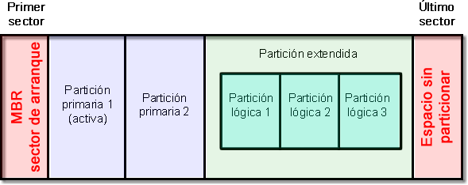

***Figura 2.** Esquema de particionado MBR.*

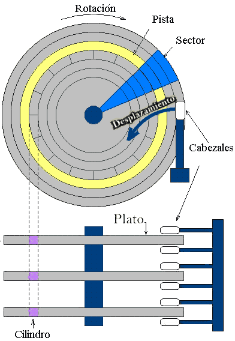

***Figura 3.*** *Estructura Lógica de un disco A-Pista. B-Sector Disco. C-Sector Pista. D-Cluster.*

De esta manera, *si dividimos un disco duro en una partición primaria* (un volumen) y una partición extendida (donde creamos 10 unidades lógicas, cada una con su propio volumen) formaremos un total de 11 volúmenes (11 letras de unidad) pero solo tendremos un sector de arranque usable como tal, el de la partición primaria.

Aunque antiguamente sólo se utilizaban las particiones primarias para instalar en ella los sistemas operativos (Windows, Linux...) y las unidades o particiones lógicas sólo se utilizaban para datos (ya sean documentos, música...), en la actualidad los sistemas operativos como Windows o cualquier distribución Linux ya se pueden instalar en una unidad o partición lógica y, a continuación, es posible arrancarlos desde gestores de arranque.

#### **1.4 Tipos de tablas de particiones más usuales:**

* msdos: limitado a 4 particiones primarias una de las cuales puede ser extendida.
* dvh: limitado a 16 particiones primarias, una de las cuales es extendida y se crea al crear la tabla.
* gpt: todas las particiones son primarias, límite muy alto (128) que depende del sistema operativo.

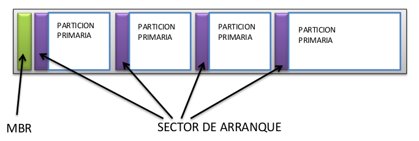

***Figura 4.** Esquema de particiones primarias.*

*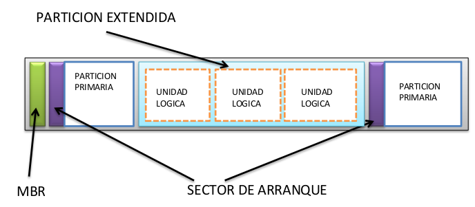*

***Figura 5.** Esquema de particiones primarias/extendidas.*

Un disco duro sólo puede tener un máximo de 4 particiones si la tabla de particiones es del tipo msdos o MBR. Si se desean gastar todas las particiones de la tabla de particiones sólo se tienen dos posibles configuraciones:

* 4 particiones primarias.
* 3 particiones primarias + 1 partición extendida.

Pensemos que si creamos 4 particiones primarias y un día nos damos cuenta que necesitamos una partición adicional, no vale sólo con redimensionar el tamaño de las particiones para dejar un poco de “hueco”. Sería necesario borrar una de las particiones primarias para crear luego una extendida con dos particiones lógicas dentro. Siguiendo con el ejemplo anterior, las particiones anteriormente sugeridas podrían tener el siguiente tipo:

* 1 partición primaria para Windows.
* 1 partición primaria para Linux.
* partición extendida:
  + 1 partición lógica para Intercambio.
  + 1 partición lógica para Documentos.
  + 1 partición lógica para Varios.

#### **1.5 Ejemplos**

Como se ha comentado anteriormente, el particionamiento de un disco duro da lugar a tres tipos de particiones: primarias, extendidas y lógicas. A continuación se muestran distintos escenarios posibles:

|  |  |
| --- | --- |
| MBR | Partición primaria 1 |

|  |  |  |
| --- | --- | --- |
| MBR | Partición primaria 1 | Espacio libre |

|  |  |  |
| --- | --- | --- |
| MBR | Partición primaria 1 | Partición primaria 2 |

|  |  |  |  |
| --- | --- | --- | --- |
| MBR | Partición primaria 1 | Partición primaria 2 | Espacio libre |

|  |  |  |  |
| --- | --- | --- | --- |
| MBR | Partición primaria 1 | Partición primaria 2 | Partición primaria 3 |

|  |  |  |  |  |
| --- | --- | --- | --- | --- |
| MBR | P. primaria 1 | P. primaria 2 | P. primaria 3 | Espacio libre |

|  |  |  |  |  |
| --- | --- | --- | --- | --- |
| MBR | P. primaria 1 | P. primaria 2 | P. primaria 3 | P. primaria 4 |

|  |  |  |  |  |  |
| --- | --- | --- | --- | --- | --- |
| MBR | P. primaria 1 | P. primaria 2 | P. primaria 3 | P. primaria 4 | Espacio libre |

|  |  |  |
| --- | --- | --- |
| MBR | Partición primaria 1 | Partición extendida |

|  |  |  |  |
| --- | --- | --- | --- |
| MBR | Partición primaria 1 | Partición extendida | Espacio libre |

|  |  |  |  |  |
| --- | --- | --- | --- | --- |
| MBR | P. primaria 1 | P. primaria 2 | P. primaria 3 | P. extendida |

|  |  |  |  |  |  |
| --- | --- | --- | --- | --- | --- |
| MBR | P. primaria 1 | P. primaria 2 | P. primaria 3 | P. extendida | Espacio libre |

|  |  |  |  |  |  |  |
| --- | --- | --- | --- | --- | --- | --- |
| MBR | P. primaria 1 | P. primaria 2 | P. primaria 3 | P. extendida   |  |  | | --- | --- | | P. lógica 1 | P. lógica 2 | |

|  |  |  |  |  |  |  |  |
| --- | --- | --- | --- | --- | --- | --- | --- |
| MBR | P. prim. 1 | P. prim. 2 | P. prim. 3 | P. extendida   |  |  |  | | --- | --- | --- | | P. lógica 1 | P. lógica 2 | Libre | |

**MBR:** El Master Boot Recrod, es un registro de arranque principal, conocido también como registro de arranque maestro. Es el primer sector ("sector cero") de un dispositivo de almacenamiento de datos, como un disco duro. En ocasiones, se emplea para el arranque del Sistema Operativo con bootstrap, otras veces es usado para almacenar una tabla de particiones y, en ocasiones, se usa sólo para identificar un dispositivo de disco individual, aunque en algunas máquinas esto último no se usa y es ignorado.

Solo el sector de arranque de una partición primaria es válido para arrancar el sistema operativo. El sector de arranque de la partición extendida solo contiene información sobre las unidades lógicas que se encuentran dentro de ella (tamaños, comienzos y finales, etc.).

La tabla del MBR identifica la localización y tamaño de la partición extendida, pero no contiene información sobre las unidades lógicas creadas dentro de esta partición extendida. Ninguna de estas unidades lógicas pueden ser marcadas como activas, por lo que es posible que instalemos un sistema operativo en alguna de estas particiones lógicas, pero nunca podrá ser cargado directamente, ya que no podemos marcar esa partición como activa, y por lo tanto no podemos indicar que sea el volumen de arranque. (Para poder instalar sistemas operativos en estas unidades lógicas, tendremos que usar un programa conocido como gestor de arranque que veremos posteriormente, estos gestores de arranque suelen guardar los programas usados para cargar los sistemas operativos siempre en la partición activa del disco duro).

Hemos visto como el ***MBR*** se divide en dos partes bien diferenciadas, el programa MBR que ocupa la mayor parte del MBR y la tabla de particiones vista anteriormente.

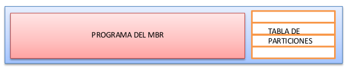

***Figura 6.** Esquema de MBR y tabla de particiones.*

Existen diversos programas que nos permiten gestionar y retocar estos componentes del MBR. En sistemas Windows se tiene el comando ***FIXMBR*** que reinstala el programa del MBR, aunque este comando solo podemos usarlo desde la consola de recuperación. (Ya veremos cómo acceder a dicha consola en el siguiente tema).

La *tabla de particiones*, puede ser gestionada por diversos programas que se incluyen en los sistemas operativos. En sistemas antiguos Windows, la utilidad encargada de esto es el **FDISK**. En la familia Windows más moderna (7, 8, 10, 2012 Server, etc..) es la consola del administrador de discos (***diskmgmt.msc***). Esta consola es la incluida oficialmente por la propia Microsoft, y existen multitud de programas de terceras compañías que permiten retocar esta tabla de particiones. (No es recomendable el uso de dichas herramientas pues pueden estropear la tabla, y suelen dar problemas a la larga). En la familia Windows 2012 Server, Windows 7,8 y 10 encontramos también una herramienta de línea de comandos que permite gestionar las particiones, ***diskpart.exe***.

Los sistemas GNU/Linux por su parte incluye varios programas de este tipo, como pueden ser fdisk, gdisk, qtparted, parted, etc.

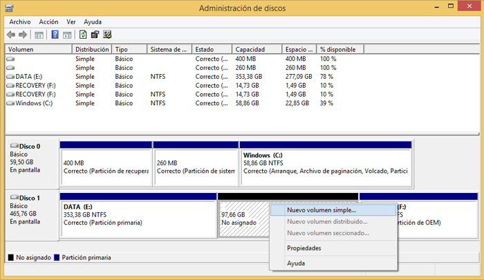

***Figura 7.** Administrador de discos de Windows.*

### 2. **Reparar MBR en Windows 10/11**

Por diversos motivos el MBR podría dañarse o corromperse debido a apagones, cuelgues, ciertos tipos de virus o gusanos, instalaciones inadecuadas del Sistema Operativo, mal uso de ciertas aplicaciones específicas relacionadas con el particionado, entre otros. Los daños en este sector provocan de inmediato que el Sistema Operativo no consiga arrancar mostrando ciertos mensajes característicos por pantalla del tipo:

* No se ha encontrado el sistema operativo.
* Falta **BOOTMGR** presione Ctrl + Alt + Del para reiniciar el sistema.
* Inserte un dispositivo de arranque.

Una primera opción consiste en probar a arrancar la utilidad de recuperación del DVD de Windows y escoger la opción "Reparación de inicio". Sin embargo esta opción suele fallar bastante por lo que es recomendable realizar el proceso de forma manual utilizando desde la consola (Símbolo del sistema) el comando **bootrec** de la forma siguiente:

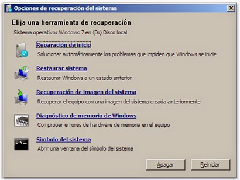

***Figura 8.** Ventana Opciones de recuperación del sistema.*

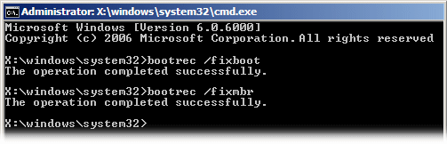  
***Figura 9.** Consola del sistema.*

La unidad X representa una partición temporal que Windows crea para cargar las herramientas de recuperación y poder trabajar. Para finalizar, y por si ha sido dañado el gestor de arranque de Windows 7 se puede proceder a copiar manualmente el fichero bootmgr desde la unidad de DVD a la unidad donde esta la instalación de Windows.

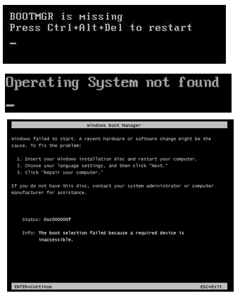

***Figura 10.** Errores en MBR o Boot Manager Windows.*

### 3. Particiones GPT

**GPT** (GUID Partition Table), es el nuevo estándar que está sustituyendo a MBR y que está asociado con los nuevos sistemas UEFI. Su nombre viene de que a cada partición se le asocia un único identificador global, GUID. A día de hoy, GPT no tiene ningún límite más allá que los que establezcan los propios Sistemas Operativos, tanto en tamaño como en número de particiones (por ejemplo, Windows tiene un límite de 128 particiones).

A la hora de dar formato a un disco duro, el estilo de tablas de particiones más conocido es MBR (msdos). Este estilo de formato lleva más de 30 años funcionando en la mayor parte de sistemas operativos, sin embargo, con las últimas versiones de Windows, especialmente coincidiendo con el auge de los sistemas UEFI, MBR está siendo sustituido por un nuevo estilo de particiones, GPT, más fiable, moderno y listo para acabar con las principales limitaciones de la estructura MBR.

Desde la aparición de Windows 8, Microsoft empezó a configurar GPT como tabla de particiones por defecto al dar un nuevo formato al disco. Poco a poco, GPT irá reemplazando a MBR como estilo de particiones por defecto. Ambos son dos formas diferentes de crear y gestionar las tablas de particiones de un disco duro.

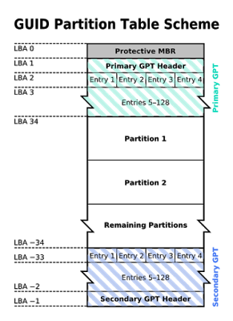

***Figura 3.1.11** Esquema tabla de partición GUID.*

La fiabilidad de los discos GPT es mucho mayor que la de MBR. Mientas que en esta segunda la tabla de particiones se almacena solo en los primeros sectores del disco, estando en problemas en caso de que se esta se pierde, corrompe o sobrescribe, GPT crea múltiples copias redundantes a lo largo de todo el disco de manera que, en caso de fallo, problema o error, la tabla de particiones se recupera automáticamente desde cualquiera de dichas copias.

***Figura 3.1.12.** Tablas de particiones MBR vs GPT.*

En términos de compatibilidad, a la hora de crear o editar particiones, la herramienta de particionado debe ser compatible con este nuevo formato, de lo contrario, se activará una especie de protección para evitar que la herramienta incompatible confunda la tabla de particiones GPT con una MBR “sin formato” y se puedan sobrescribir las particiones.

En cuanto a *sistemas operativos, Windows* solo puede arrancar desde discos GPT en sus versiones de 64 bits desde Vista en adelante. Los sistemas de 32 bits, aunque no pueden arrancar desde estos discos, sí que son capaces de leer y escribir en ellos sin problemas.

Las *versiones actuales de Linux* también son compatibles con este tipo de discos, e incluso Apple ha empezado a utilizar GPT como tabla de particiones por defecto en lugar de su propia APT (Apple Partition Table).

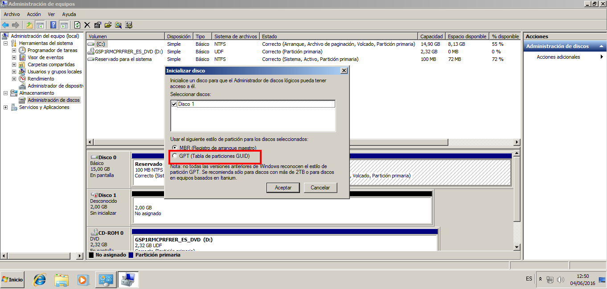

***Figura 3.1.13.** Administrador de discos de Windows 7: Inicializar disco nuevo GPT.*

**Estructura**

* **Cabecera de tabla de particiones:** Define los bloques de disco que pueden ser utilizados por el usuario y el número y tamaño de las entradas de partición que conforman la tabla de particiones. Contiene el GUID del disco y registra su propio tamaño y localización (siempre LBA 1), y el tamaño y la localización de la cabecera y tabla de la GPT secundarias (siempre en el último sector del disco).  
  Entradas de partición: Contienen tipo, GUID de partición, comienzo y final de partición, nombre y otros atributos.
* **MBR heredado:** Se ha mantenido un MBR al principio del disco para evitar que las herramientas antiguas de manejo de discos basados en MBR, que no reconocen GPT, se confundan y puedan estropear el disco. Este MBR de seguridad especifica, contiene una única entrada de partición que abarca toda la unidad GPT.

**Observaciones**

Mientas que en **MBR** la tabla de particiones se almacena en el primer sector del disco, con los consiguientes problemas en caso de que dicho sector se pierda, corrompa o sobrescriba, GPT crea múltiples copias redundantes a lo largo de todo el disco de manera que, en caso de fallo, problema o error, la tabla de particiones se recupera automáticamente desde cualquiera de dichas copias.

**Referencias**

* <https://msdn.microsoft.com/es-es/library/dn336946.aspx>
* [Wikipedia](https://es.wikipedia.org/wiki/Tabla_de_particiones_GUID)
* [Softzone](https://www.softzone.es/2016/03/25/mbr-gpt-estos-dos-estilos-particiones-discos/)
* [Wiki archLinux](https://wiki.archlinux.org/index.php/Partitioning_(Espa%C3%B1ol)#GUID_Partition_Table)

### 4. Cómo saber si un disco tiene una tabla de particiones GPT o MBR

Existen varias formas de saber si un disco utiliza una u otra tabla de particiones. Para ello podemos utilizar el propio administrador de discos de Windows, una herramienta de particionado cualquiera (a ser posible, moderna) o, como vamos a ver a continuación, la herramienta **diskpart**.

Abrimos una ventana de CMD, recomendablemente con permisos de administrador, y tecleamos en ella “diskpart“.

Una vez cargue la herramienta y tendamos ya la línea de comandos de ella, simplemente ejecutamos “list disk” para ver una lista con todos los discos conectados a nuestro PC.

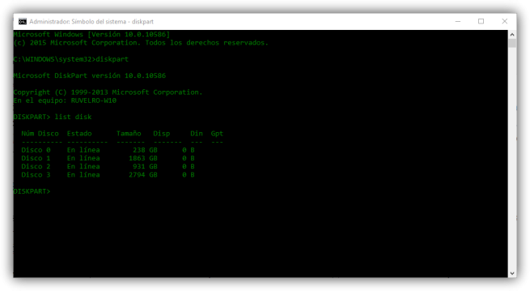

***Figura 3.1.14.** Ejecución de diskpart.*

En esta lista, podemos ver una columna llamada GPT. Todos los discos que tengan un asterisco \* en esta columna serán aquellos que utilicen esta nueva tabla de particiones.

### 5. Cómo convertir un disco MBR a GPT y viceversa

Es importante conocer que este proceso borrará todos los datos del disco duro, por lo que debemos hacer una copia de ellos si queremos pasar de un formato a otro.

Aprovechando la herramienta “diskpart” que hemos visto en el punto anterior, es posible convertir un disco duro de MBR a GPT y al revés. Para ello, tras haber ejecutado “list disk”, anotaremos el número del disco que queremos convertir (Disk X) y teclearemos “select disk X” (donde X es el número del disco).

A partir de ahora estamos trabajando con este disco en concreto.

Tecleamos “**clean**” para borrar todos los datos de las particiones del disco y dejarlo como nuevo, recién salido de fábrica. Una vez finalice la limpieza tecleamos:

* Para convertir un disco de MBR a GPT: convert gpt
* Para convertir un disco de GPT a MBR: convert mbr

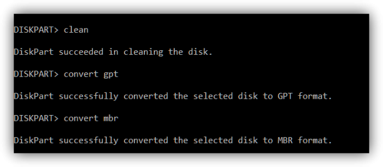

***Figura 3.1.15.** Convertir disco de gpt a mbr.*

Una vez finalice el proceso de conversión de la tabla de particiones, el disco estará sin formato. Debemos utilizar la propia herramienta “diskpart” o cualquier otro administrador de particiones para crearlas de nuevo, al menos una de ellas, para que todo siga funcionando con normalidad.

Existen herramientas de terceros para pasar de un tipo a otro sin perder los datos, al menor en teoría. Pese a ello, y a los riesgos que esto supone, os recomendamos hacer siempre una copia de seguridad de todos los datos del disco, por lo que pueda pasar.

### 6. Caso práctico: Particionado de disco gpt

En el siguiente vídeo se describe el proceso de creación de una tabla de partiocines gpt en un disco para su posterior particionado e instalación de Windows 10.

**[Vídeo 1. Crear tabla particiones en disco Gpt.](https://www.youtube.com/watch?v=M_Dx5Jy2bMo&t=13s)**

## 2.3.2 Sistemas de ficheros

Antes de poder albergar información, las particiones que pueden albergar datos (las primarias y las lógicas) deben formatearse. Formatear es, en esencia, otorgar un nombre a la partición y elegir su sistema de ficheros. El objetivo de un sistema de ficheros es establecer los mecanismos de almacenamiento y búsqueda de los ficheros que van a ser albergados en dicha partición.

Cada sistema operativo (S.O.) es compatible únicamente con una serie sistemas de ficheros. Si un Sistema Operativo se topa con un sistema de ficheros que no reconoce, éste será incapaz de acceder a su contenido.

Pese a que existen más sistemas de ficheros, a continuación se verán los más importantes:

### A) Windows

**FAT16** (File Allocation Table): Es muy antiguo. Utiliza 16 bits para direccionar la memoria lo que supone una serie de limitaciones:

* Los ficheros no pueden superar los 2 GiB.
* Sólo es capaz de almacenar 65.517 ficheros.
* Los discos no pueden superar los 2 GiB.

**FAT32**: Usado aún como formato para las tarjetas flash de cámaras y móviles. Utiliza 32 bits para direccionar la memoria con lo que tiene las siguientes limitaciones:

* Los ficheros no pueden superar los 4 GBytes.
* Las particiones sólo pueden albergar 268.435.437 ficheros.
* Los discos no pueden superar los 2 TBytes.

**NTFS** (NT File System): Se introdujo con la versión de Windows NT y está basado en el sistema de ficheros HPFS (High Performance File System) de IBM/Microsoft (usado en el sistema operativo OS/2). NTFS está pensado para trabajar con particiones y ficheros de gran tamaño. Esta es la razón de por qué es tan recomendable su uso hoy en día.

* Los ficheros no pueden superar los 16 TiB.
* Las particiones sólo podrán albergar hasta 4.294.967.295 ficheros.
* Los discos no pueden superar los 256 TiB.

**NTFS** es compatible con **FAT32.** De hecho, es perfectamente posibletransformar una partición FAT32 a NTFS sin riesgo de perder ningún dato, **pero** **no al revés**.

### B) Linux

**EXT2** (second EXTended filesystem): Todos los formatos EXT son sistemas de ficheros para el kernel de Linux. EXT2 mejora el sistema FAT teniendo menos limitaciones:

* Archivos de tamaño máximo 2 TBytes.
* Máximo número de archivos: 1018.
* Discos de tamaño máximo 16 TBytes.

**EXT3** (third EXTended filesystem): Es una mejora del sistema EXT2 y es compatible con su antecesor. De hecho, las particiones EXT3 pueden ser montadas y usadas como particiones EXT2.

* Las limitaciones son muy similares a las de EXT2.
* Tiene la funcionalidad de journaling.

**EXT4** (fourth EXTended filesystem): Es el sucesor de EXT3 y proporciona una mejora significativa tanto en rendimiento como en limitaciones.

* Archivos de tamaño máximo 16 TBytes.
* Máximo número de archivos: 4 mil millones.
* Discos de tamaño máximo 1024 PBytes = 1 EBytes (260 bytes).
* Tiene la funcionalidad de journaling.
* **EXT4** es, además, compatible con las versiones anteriores. Así, podemos montar una partición EXT2 o EXT3 como si fuera EXT4, pero no al revés.

**Aunque Windows no soporta de manera nativa EXT2 ó EXT3, pueden** instalarse drivers[1](#sdfootnote1sym) para poder acceder a ese tipo de sistemas de archivos:

http://www.fs-driver.org/download.html (driver para ver particiones EXT2 y EXT3)

http://www.chrysocome.net/explore2fs (programa para acceder a particiones EXT2 y EXT3)**.**

**C) Mac**

**HFS** (Hierarchical FileSystem): Fue desarrollado por Apple para sus sistemas operativos Mac OS en el año 1985. Debido a su antigüedad, sufre limitaciones importantes:

* Archivos de tamaño máximo 2 GBytes.
* Máximo número de archivos: 65.535.
* Discos de tamaño máximo 2 TBytes.

**HFS+** (HFS Plus): Desarrollado por Apple para soportar archivos y discos de mayor tamaño.

* Archivos de tamaño máximo 8 EBytes.
* Máximo número de archivos: 4.294.967.295.
* Discos de tamaño máximo 8 EBytes.

**Importante****:** Linux soporta todos los sistemas de ficheros de Windows**.** Luego sideseamos que una partición sea accesible tanto desde Windows como desde Linux, es conveniente utilizar un sistema de ficheros de Windows (preferiblemente, NTFS).

[1](#sdfootnote1anc)  Driver: Es la palabra ingles para referirnos a controlador.

## 2.3.3 Gestores de particiones

Existen una gran variedad de programas que permiten crear, editar y formatear particiones. De hecho, todo sistema operativo acaba incluyendo una herramienta para gestionar las particiones durante su instalación. A continuación se describen algunos de los gestores de particiones más conocidos:

**a) Administrador de discos de Windows**

****Figura 1.** Administrador de discos de Windows.**

Se abre haciendo: ***Inicio →*  *Panel de Control →*  *Herramientas administrativas* *→*** ***Administración de equipos**.* Una vez dentro, se selecciona la opción *Administrador de discos* del árbol de opciones (a la izquierda):Es una herramienta bastante sencilla. Sólo sabe trabajar con los sistemas de ficheros de Windows y **NO permite redimensionar particiones**. Si sólo trabajamos con Windows y no queremos demasiadas complicaciones es más que suficiente.

**b) Partition magic**

Fue uno de los gestores de particiones más conocidos hace algunos años. Originalmente fue creado por la compañía *PowerQuest Corporation* pero luego pasó a manos de *Symantec*. Funciona sobre la plataforma Windows.

Mientras ***PartitionMagic*** estuvo en manos de *PowerQuest* fue actualizado regularmente, llegando hasta la versión 8. Sin embargo, desde que la compró *Symantec* no ha habido nuevas versiones, siendo la última versión la 8.05 (publicada en el 2004). Es más, *Symantec* ha dejado de fabricar y dar soporte a esta aplicación.

***PartitionMagic*** es capaz de trabajar con particiones FAT16, FAT32, NTFS, EXT2 y EXT3, permitiendo realizar redimensionados de particiones, cambios en los tamaños de los clústeres (para los formatos de Windows) así como otras utilidades varias.

**PartitionMagic** es compatible con Windows NT, 98, ME, 2000 y XP, pero no funciona ni en Windows Vista ni en Windows 7. Podemos encontrar una versión de este programa dentro del CD de recuperación llamado **Hirens Boot:** <http://www.hiren.info/pages/bootcd>

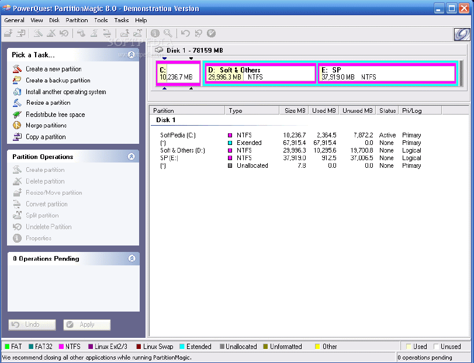

****Figura 2.** Administrador de discos Partition Magic.**

Pese a su antigüedad, sigue siendo una herramienta ampliamente usada debido a su facilidad de uso y opciones. No obstante, existen otras opciones, como el Acronis Disk Director, más modernas y las que se les sigue dando soporte técnico.

 

**c) Acronis Disk Director**

Es un programa comercial de la compañía Acronis y que funciona sobre Windows. Dispone de una suite que no sólo sirve para crear y editar particiones, si no que además nos permite recuperar particiones borradas, agregar un gestor de arranque o reparar discos dañados.

Al igual que el ***PartitionMagic***, podemos encontrar una versión de este programa dentro del CD de recuperación llamado Hirens Boot: http://www.hiren.info/pages/bootcd

**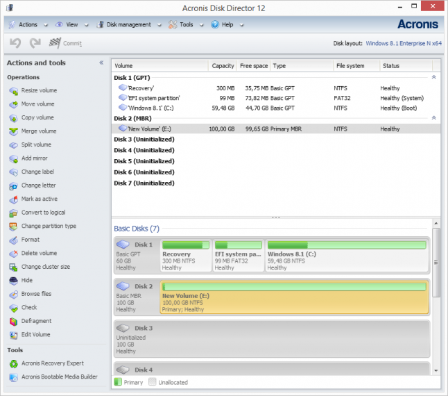**

******Figura 3.** Administrador de discos Acronis.****

**d) GParted**

Es el editor de particiones de Gnome[1](#sdfootnote1sym). Es un proyecto de código libre y en continuo desarrollo. Es sencillo de usar y permite realizar las acciones típicas sobre particiones: borrado, redimensionado, formateado, etc. ***Gparted*** soporta, además, un buen conjunto de sistemas de ficheros:

* EXT2, EXT3, EXT4 y linux-swap (la partición de intercambio).
* HFS y HFS+.
* FAT16, FAT32 y NTFS.
* Reiser4 y ReiserFS.
* FS, UFS y XFS.

Para poder usarlo no es necesario tener instalada una distribución de Linux ya que puede ser usado desde un LiveCD o incluso LiveUSB: <http://gparted.sourceforge.net/livecd.php>

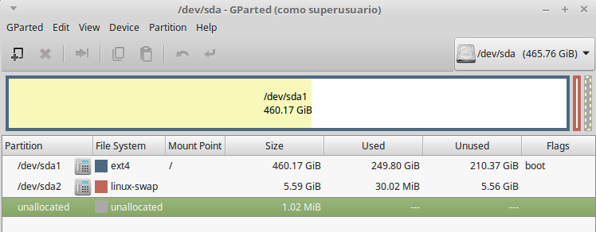

******Figura 4.** Administrador de discos gparted.****

[1](#sdfootnote1anc) Gnome es una Interfaz de Usuario de Linux.

**e) fdisk**

Es el editor de particiones de linux/Unix. Es una aplicación para el particionado de discos por consola. Fdisksoporta, además, un buen conjunto de sistemas de ficheros:

* EXT2, EXT3, EXT4, linux-swap (la partición de intercambio), vfat, etc.

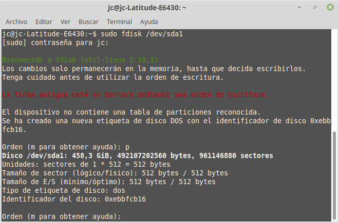

***Figura 5.** Administrador de discos con fdisk.*
