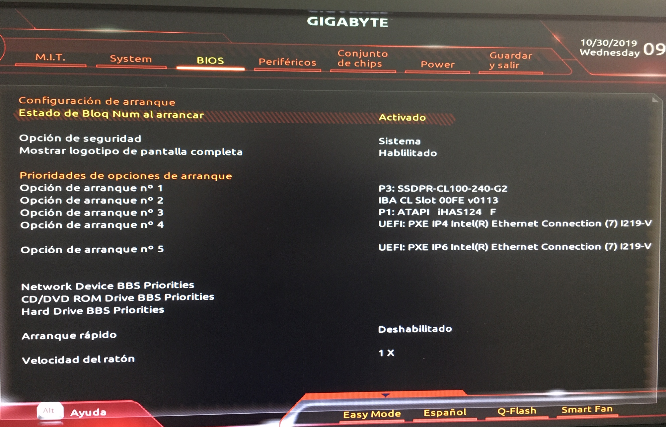
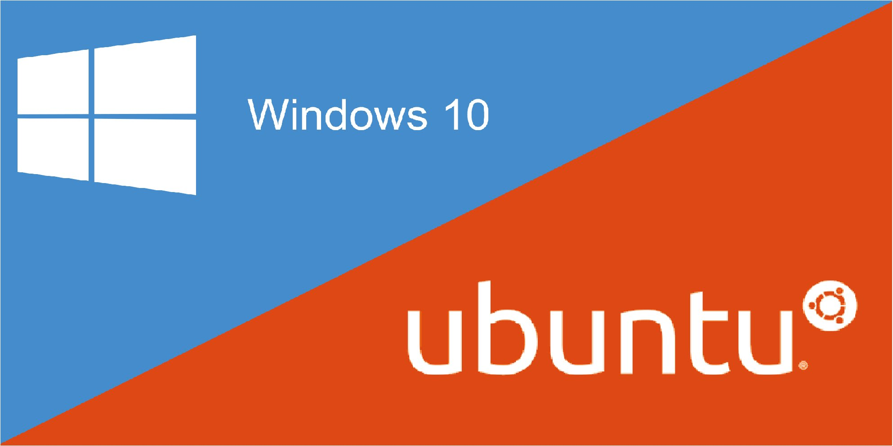
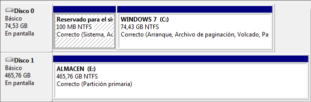

# 2.4 Instalación de sistemas operativos

En la actualidad existen tres sistemas operativos de relevancia en el mundillo de la informática personal: Microsoft Windows, GNU/Linux y Apple Mac OS X.

El más extendido de todos es Microsoft Windows, aunque GNU/linux y Mac OS X han avanzado bastante en los últimos años.

GNU/Linux destaca por ser un sistema libre, que puede ser usado sin necesidad de pagar ninguna licencia. Además, es un sistema tipo UNIX. UNIX es un sistema operativo creado a principios de los 70 que es un referente de los sistemas operativos en la historia de la informática. Además de GNU/Linux, Mac OS X es un heredero de UNIX también.

## 2.4.1 Planificación de la instalación

La instalación de todo sistema requiere una serie de pasos, es decir, hay que definir un plan de actuación. A continuación se define el plan mediante los siguientes puntos:

* Modificar la BIOS para arrancar desde el dispositivo donde tengamos el sistema a instalar (DVD o USB). En el caso de trabajar con máquina virtual, se carga la ISO en el DVD.
* Particionar adecuadamente el disco antes de la instalación (o desde el propio gestor de particiones del instalador, esta es la que se utilizará).
* Instalar los sistemas en el orden adecuado (para evitar sobre escrituras del gestor de arranque).
* Actualizar el sistema (parches, service pack, etc).
* Documentar el proceso de instalación, para ello, se hará uso de la hoja de cálculo en google y que permitirá almacenar y auditar toda la operativa dentro del proceso de instalación.

## 2.4.2 Configuración previa de la BIOS/UEFI

La ***BIOS*** es el sistema básico de entrada/salida donde se encuentran grabadas las rutinas ***POST*** (Power-On Self- Test, Autocomprobación diagnóstica de encendido). Si la BIOS no encuentra nada anormal (básicamente comprueba que no falten componentes básicos como el procesador, la memoria, el teclado, etc.), intenta arrancar desde el primer dispositivo de arranque. En caso de que no pueda arrancar desde ahí, prueba desde el segundo dispositivo, así hasta que pueda arrancar desde alguno (siguiendo el orden configurado en la BIOS). En caso de no poder arrancar desde ninguno de ellos, se muestra un mensaje de error al usuario.

El acceso al menú de configuración de la ***BIOS*** es diferente en cada placa base, aunque suele ser habitual acceder a él presionado, durante el arranque, la tecla Supr, F1 ó F2.

***Figura 1** Opciones de arranque en la BIOS.*

Una vez dentro, tendremos que buscar la ubicación del orden de arranque. Para el caso de la BIOS Figura 1, el orden se encuentra dentro de la opción BIOS.

Debido a que los sistemas operativos suelen estar en CD/DVD o USB, es necesario cambiar el orden de arranque.

Las BIOS intenta arrancar siguiendo el orden indicado. Sin embargo, ese “intento” no es gratuito, lleva un tiempo. Es por ello que si generalmente vamos a arrancar desde el disco duro, resulta recomendable establecer éste como primer dispositivo de arranque para así ahorrar tiempo en el arranque del sistema operativo. Cuando nos haga falta arrancar desde otros dispositivos (CDROM, disquetera ó USB), ya entraremos en la BIOS y cambiaremos el orden.

## 2.4.3 Fases de instalación de un sistema operativo

A continuación, se enumeran las fases en una instalación de un sistema operativo:

1. Preparar el equipo para arrancar desde DVD/USB u otro soporte booteable.
2. Preparación del Disco Duro.
3. Ejecutar el programa de instalación.
4. Proporcionar el nombre y contraseña del usuario que será administrador del sistema.
5. Seleccionar los componentes software opcionales que queremos instalar.
6. Ajustar los parámetros de la red.
7. Instalar el gestor de arranque.
8. Realizar las actualizaciones de seguridad.
9. Instalar los plugins del navegador.
10. Instalar los Drivers necesarios para los dispositivos no reconocidos en la instalación.

A continuación, se describe con detalle cada puno.

**1. Preparar el equipo para arrancar desde CD/DVD/USB.**

Si al introducir el CD/DVD/USB de instalación, no se ejecutase el programa de instalación, habrá que modificar la configuración de la BIOS, para escoger el CD/DVD/USB como primer dispositivo para el arranque.

Esta operación depende del modelo de placa base/madre del equipo, por lo que de ser posible consultaremos la documentación del fabricante.

**2. Preparación del Disco Duro.**

Esta fase consiste en crear las particiones del tipo necesario para que nuestro Sistema Operativo pueda instalarse.

En Windows los tipos de particiones que se emplean son FAT32 (Windows 95/98) y NTFS (Windows NT/2000 y XP). En Linux/UNIX, se aceptan muchos más tipos de particiones, siendo el sistema de ficheros más popular el EXT3/EXT4.

Si queremos instalar un sistemas operativo en un disco donde ya haya otro sistema operativo instalado, Es muy importante hacer copia de seguridad de los datos importantes antes de proseguir la instalación, ya que existe un alto riesgo de perderlos **TODOS** por un error durante el proceso. Una vez hecho esto, tendremos dos opciones:

* Sustituir el sistema operativo anterior.
* Instalarlo permitiendo su coexistencia y selección durante el periodo de arranque del ordenador. Sistema Dual.

Si elegimos la primera opción, suele ser buena idea borrar en el proceso de instalación las particiones antiguas y después crear las nuevas, realizando una comprobación completa de su estado para conocer si hay errores o defectos en el disco.

En el caso de querer hacer una instalación dual, habrá que conseguir espacio suficiente para instalar el nuevo sistema operativo, normalmente restándoselo a las particiones existentes anteriormente para el primer sistema. Esta delicada tarea, suele hacerse con herramientas software especiales, como GParted. 

Suele ser muy interesante por motivos de seguridad, crear particiones independientes para guardar los datos de los usuarios (por ejemplo una unidad D: en Windows, o directorio /home en Linux).

**3. Ejecutar el programa de instalación.**

Para ello, normalmente bastará con introducir el CD de instalación y volver a encender el equipo con el dentro. Debemos estar atentos a los primeros instantes para leer un posible mensaje de proceder a la instalación y aceptarlo. En caso contrario, bastará con esperar sin hacer nada.

**4. Proporcionar el nombre y contraseña del usuario que será administrador del sistema.**

Todo sistema multiusuario que se precie, debe tener un responsable de su funcionamiento, mantenimiento y de otorgar permisos de uso del equipo y/o sus recursos a terceros. Es durante la fase de instalación durante la que se especifica la contraseña pare el mismo. En los sistemas UNIX, el nombre del administrador es siempre “root”. En sistemas como Windows o Ubuntu, esta labor la lleva el primer usuario creado, hasta que se especifique lo contrario.

**5. Seleccionar los componentes software opcionales que queremos instalar.**

Muchas distribuciones de Sistemas Operativos pueden contener software adicional (en ocasiones varios CD o DVDs) que puede ser instalado durante al instalación del mismo. Es habitual que se nos pregunte por qué selección de programas recomendada o personalizada queremos instalar. Una vez hecho esto, comienza la copia de todos los ficheros necesarios desde los soportes de instalación al disco duro del equipo.

**6. Ajustar los parámetros de la red.**

Si nuestro equipo va a ser utilizado en una red local o en Internet, habremos de configurar adecuadamente el dispositivo de comunicaciones (normalmente la tarjeta de red). Para ello, necesitaremos obtener la información pertinente del administrador de al red o del proveedor de servicios de Internet que tengamos contratado en su caso.

Lo más común, (y por tanto la instalación por defecto) es que los equipos se configuren de modo que automáticamente consigan el ajuste necesario de la red desde otro equipo que los coordina a todos, mediante un protocolo denominado DHCP (Dinamyc Host Control Protocol). Si es así, no necesitamos hacer nada más.

En caso contrario, deberemos obtener y anotar la información correspondiente para la tarjeta de red:

* **Dirección IP:** el número que distingue nuestro ordenador en la red para comunicar.
* **Máscara de subred:** un número que ayuda a distinguir si las direcciones que buscamos son de nuestra red local o externos.
* **Puerta de enlace predeterminada**: la dirección IP del equipo (p.ej. Router) que nos da acceso a otras redes, como por ejemplo Internet.
* **Dirección de un servidor de DNS.:** La dirección del equipo que puede informarnos de la dirección IP de otro que solo conocemos por su nombre de dominio. Hacen el trabajo de las “páginas blancas” de Internet.

**7. Instalar el gestor de arranque.**

Al instalar el sistema operativo, es necesario incluir en el sector de arranque del Disco Duro (llamado MBR o Master Boot Record), un pequeño programa que nos permite encontrar en qué parte del disco se encuentran los distintos sistemas operativos, y seleccionar uno para comenzar a trabajar cuando encendemos el equipo.

En las instalaciones de Linux, el programa en cuestión suele ser GRUB (GRand Unified Bootloader).

En Windows, tras su instalación, se destruye el cargador de arranque que estuviese antes, y solo quedará la posibilidad de acceder a dicho sistema operativo. Es por ello muy conveniente que de tener instalado Linux en nuestro ordenador además de Windows, dispongamos de un CD/DVD/USB de arranque que también tenga el GRUB en él para poder arreglar el destrozo que provocará la reinstalación de Windows cuando probablemente ocurra.

Si tras instalar Linux, no podemos arrancar el Windows anteriormente instalado (caso poco probable), podremos reponer el de Windows con un disco de arranque de Windows introduciendo por teclado la orden: **fdisk /mbr**

Hay que asegurase de tener antes un CD/DVD/USB de arranque con GRUB configurado antes de usar fdisk, o no podrá volver a arrancar Linux después.

**8. Realizar las actualizaciones de seguridad.**

Probablemente, desde que se publicó la versión de nuestro Sistema Operativo hasta el momento de la instalación, se han publicado correcciones del mismo que pueden aplicarse mediante un proceso de actualización a través de Internet, o de discos de “Service Pack” que las contienen cuando ya son muy numerosas.

De no llevarlas a cabo, es muy probable que en poco tiempo tengamos problemas causados por virus, intrusos a través de la red o fallos del propio Sistema Operativo desconocidos en el momento de su publicación.

**9. Reiniciar el sistema.**

Es la fase final de la instalación, y nos mostrará que el sistema está convenientemente instalado.

Antes de hacerlo, debemos asegurarnos de que hemos retirado el CD/DVD/USB de instalación, o volveremos otra vez iniciar el proceso. Si es así, apagamos el equipo y sacamos inmediatamente el CD/DVD/USB en los primeros instantes del arranque.

**10. Instalar los Drivers necesarios para los dispositivos no reconocidos en la instalación.**

Es habitual que si se instala el sistema operativo, no nos funcione aún o al menos correctamente la impresora, el escáner, la “tarjeta de sonido” la tarjeta gráfica, la tarjeta sintonizadora de TV, etc.

Para que puedan hacerlo, es necesario instalar en nuestro Sistema Operativo los ***DRIVERS*** de los mencionados dispositivos correspondientes a la versión de nuestro sistema operativo, y a ser posible actualizados.

En muchos casos, el propio Sistema Operativo los instala, pero debido a la gran variedad de tipos de dispositivos y de fabricantes existentes en la actualidad, es imposible incluirlos todos.

Para conseguir los drivers, recurrimos al disco de instalación del dispositivo o a la página WEB del fabricante del mismo (por ej.: HP, EPSON, Nvidia, ATI, CREATIVE, etc...), seleccionando los de nuestro Sistema Operativo y versión del mismo.

En ocasiones suele ser necesario reiniciar el ordenador, sobre todo en entornos Windows.

## 2.4.4 Comprobación de los requisitos técnicos

El primer paso para la instalación de un equipo de escritorio será la comprobación de que se cumplen tanto los requisitos hardware como software. En lo relativo al hardware, uno de los aspectos más importantes será el procesamiento, almacenamiento y comunicación.

También hay que estudiar tanto la potencia necesaria como la compatibilidad con el sistema operativo y el resto de elementos que pretendemos instalar, aunque la situación será mucho más determinante al referirnos al servidor o servidores.

En ocasiones, dispondremos de un equipamiento previo sobre el que, en el mejor de los casos, podremos realizar ciertas modificaciones y/o actualizaciones. En estos casos, deberemos ajustar las características de nuestra implantación a los recursos existentes. En otras situaciones, tendremos libertad para diseñar todos los aspectos de nuestra instalación, adquiriendo el material necesario para ponerla en práctica. Sea cual sea la situación que se produzca, determinará en gran medida el resto de las decisiones que tomemos.

Por lo tanto, algunas de las preguntas que deberemos hacernos son las siguiente:

* ¿Qué sistema operativo me ofrecerá mejor rendimiento en un equipo de escritorio?. Las mayoría de las veces, los ordenadores del lado cliente serán los que tengan una capacidad de cálculo más ajustada y, además, son los que más tardan en actualizarse o sustituirse dentro de la estructura de una empresa. Por ejemplo, dado un determinado ordenador, deberemos averiguar si un sistema operativo tendrá un mejor comportamiento que otro. Para ello, podremos comprobar sus requisitos mínimos y recomendados.
* ¿Los sistemas operativos elegidos soportan todo el *hardware* necesario?, ¿disponen de los *drivers* adecuados? Es muy frecuente que algunos sistemas operativos, sobre todo los de software libre, no dispongan de todos los *drivers* necesarios para todos los modelos de impresoras, escáneres, u otros dispositivos que podamos necesitar en el presente o en el futuro. Por esto, la elección del sistema operativo puede verse condicionada por los dispositivos que ya tenemos o, al contrario, la adquisición de nuevos dispositivos estará supeditada al sistema operativo por el que nos hayamos decantado.
* ¿Los costes arrojados por el diseño son asumibles para la empresa? Un error común es sobredimensionar todo el diseño para asegurarnos de que cumple con todas las necesidades presentes y futuras, pero esto nos puede llevar a plantear un coste excesivo. Por este motivo, debemos hacer el estudio con el máximo rigor y ofrecer un resultado ajustado a las necesidades reales.

### Actividad 1. Tabla de requisitos mínimos y comparativa

La actividad trata de que se realice una tabla comparativa con los requisitos mínimos de Windows 10, Windows 11 y Ubuntu Desktop 22.04.1 LTS en sus versiones de 64 bits. Además, tendrás que describir las ventajas y desventajas que presentan las distribuciones de Windows y Ubuntu Desktop una respecto la otra. Respecto a los componentes con requerimientos mínimos y recomendados, se proponen buscar los siguientes:

* Procesador Mínimo.
* Procesador Recomendado.
* Memoria RAM Mínima y Recomendada.
* Nº de procesadores/núcleos.
* Espacio de disco mínimo y recomendado.
* Tarjeta gráfica mínima y recomendada.
* Unidad DVD.
* etcétera.

Por último, tendrás que realizar una comparativa más exahustiva entre Windows 11 64 bits y Ubuntu Desktop 22.03.1 LTS 64 bits.

**Windows vs Ubuntu.**

## 2.4.5 Instalación de Windows

### 1. Introducción

La instalación de ***Windows*** es bastante sencilla. Lo primero que hay que tener en cuenta es que ***Windows 7, 8 y 10*** sólo puede instalarse sobre ***sistemas de ficheros NTFS***. Dichas particiones pueden ser creadas y formateadas a través del propio instalador de Windows o bien se puede realizar con anterioridad haciendo uso de algunas de las herramientas ya vistas. El resto del proceso es totalmente guiado y muy fácil (se verá en las prácticas).

Sin embargo, hay un detalle importante a tener en cuenta. ***Windows***, después de su instalación, ***sobreescribe siempre el sector de arranque*** ***con la información necesaria para que el siguiente arranque se haga desde la partición donde acaba de ser instalado Windows***. En caso de detectar más de un sistema operativo Windows, el instalador inserta un menú de arranque (parecido al de GRUB) que puede ser gestionado desde el último Windows instalado.

No obstante, hay que tener en cuenta que el instalador de Windows sólo “ve” aquellos sistemas cuya versión sea igual o inferior a la que está siendo instalada.

Si se quiere instalar Windows 7 y Windows 8, es importante primero instalar 7 y luego 8. En caso de hacerlo al contrario, Windows 7 no “vería” el sistema Windows 8 y sobrescribiría el sector de arranque sin insertar un menú, perdiendo el acceso a dicho sistema.

Para instalar Windows 10, simplemente hay que tener en cuenta los siguientes aspectos:

* Número de particiones a usar (las que crea el sistema, la raíz, etc..).
* Datos del usuario  (Nombre, user, password).

El resto de aspectos, los puedes visualizar en el siguiente vídeo donde se describe el proceso completo de la instalación de Windows 10. El vídeo no contempla todo el proceso, es decir, se han realizado pausas en momentos como: copia de ficheros masiva, descarga de ficheros, etc.., todo lo relacionado al progreso de acciones donde no hay interacción con el usuario.

[▶ Ver vídeo: Instalación de Windows 10](https://www.youtube.com/watch?v=LdhX7PLBlIk)

***Video 1.** Instalación de Windows 10.*

### **2. Partición reservada de Windows**

Cuando instalamos el Sistema Operativo, ***si el proceso detecta espacio sin asignar*** en lugar de una partición, se genera de forma automática una partición reservada para los ficheros de arranque del sistema, de tamaño **100MB** en Windows 7, **500MB** en Windows 10 y que se marcará como partición activa (esta opción es la que recomienda Microsoft).  
Sin embargo, ***si el proceso detecta particiones existentes***, se omite dicha partición reservada incluso aunque no esté. Lo que hace la instalación entonces, es almacenar en la partición existente que seleccionemos los ficheros de arranque y el resto de archivos del Sistema Operativo.

#### **2.1 Características**

La partición reservada para el sistema de ***100MB en Windows 7*** o ***500 MB en Windows 10***, es una partición oculta que crea de forma automática Windows 7/8/10 y que tiene ciertas características  o funciones que hay que saber:

* Permite el uso de [**BitLocker**](https://technet.microsoft.com/es-es/library/dd835565(v=ws.10).aspx) (ver nota) con la partición del sistema.
* Permite crear un entorno aislado desde donde lanzar la recuperación del sistema (F8 durante el arranque del PC), aunque ésto último, salvo daño grave del sistema operativo, también se puede hacer sin necesidad de tener esa partición oculta, desde el DVD de instalación, o empleando software externo.
* Además contiene los ficheros de arranque de Windows (bootmgr, \Boot, etc.), los cuales, hasta ahora, se ubicaban en la raíz del sistema. *******Figura 1.** Partición reservada.*

**BitLocker** permite mantener a salvo todo, desde documentos hasta contraseñas, ya que cifra toda la unidad en la que Windows y sus datos residen. Una vez que se activa **BitLocker**, se cifran automáticamente todos los archivos almacenados en la unidad.

#### **2.2 Evitar la partición reservada**

Tenemos varias forma de evitar que se realice la partición reservada:

* Si el disco duro está sin particionar y el particionado se hace desde el DVD de **Windows 10/11** la partición se crea de manera automática pero si el disco duro se particiona antes de la instalación (P.ejemplo con GParted, Acronis, etc.) y no se modifica nada desde el DVD de instalación excepto formatear la partición en NTFS (operación que si es recomendable hacer desde el DVD del sistema), la partición reservada no se crea y **Windows 10/11** se instala alguna de las particiones que ya estaban creadas.
* Otra manera sería, desde el propio proceso de instalación, al llegar a la pantalla que nos habla de las particiones, hacer clic en ***"Opciones de unidad (avanzadas) para eliminar las particiones existentes y crear una nueva partición"***. Al hacerlo veremos en la pantalla el mensaje siguiente: *"Para garantizar que todas las características de Windows funcionen correctamente, Windows puede crear particiones adicionales para los archivos de sistema."* A continuación se habrán creado  dos particiones, una de ellas la partición reservada de sistema de 100 MB (500MB 8/10) y otra la principal. El proceso consistiría en eliminar la principal (pasando a ser espacio no asignado) y extender la partición reservada de sistema de 100 MB. Extenderemos la partición de acuerdo al espacio libre del que disponemos. Por último se le da formato y una vez finalizado el formateo, la partición reservada original del sistema se transformará en una partición del sistema normal.

#### **2.3 Ventajas y desventajas de separar las particiones de arranque y de sistema**

**Ventajas**

* Tener una partición separada para los ficheros de arranque es beneficioso puesto que facilita la instalación de múltiples sistemas operativos de la familia Windows.
* Algunos virus y malware (aunque cada vez menos) suponen que el Sistema Operativo reside en la unidad C. Al tener los archivos del Sistema Operativo en otra partición, el código del virus fallará.
* Ciertas herramientas relacionadas con el almacenamiento, como **Bitlocker** requieren una configuración de particiones en la que la unidad de arranque esté separada de la unidad del sistema para poder cifrar correctamente el contenido de un volumen.

**Inconvenientes**

* Si se desea crear una imagen del Sistema Operativo para poderla restaurar, será necesario hacer imagen de la partición reservada también puesto que al contener el arranque también es susceptible de dañarse. Este tipo de imágenes es muy habitual en configuraciones donde el usuario separa los datos del sistema en particiones separadas.
* Si se quiere hacer un arranque multi-sistema con gestores de arranque de terceros, no con el que incorpora el propio Windows -gestor que ya sabemos que es muy suyo y no se lleva bien con otros Sistema Operativo que no sean de la casa- por ejemplo Grub, puede que el sistema no arranque al no ser capaz de gestionar la partición reservada. A partir de **Grub2** ya es posible hacer un arranque multi-sistema (Linux-Windows) con esa partición reservada sin problemas.

#### 2.4 Conclusiones

Aunque Microsoft recomienda dejar que Windows gestione la partición reservada podemos deducir que si no es necesario el uso del BitLocker con la partición de Windows puede evitarse su creación.

Para finalizar,  se muestran algunos escenarios de posibles errores durante la instalación de Windows

**Escenario 1.** Se instala **Windows 10 64 bits** y la instalación lanza un mensaje diciendo que *"El sistema no puede instalarse porque el disco está en GPT y el hardware posiblemente no es capaz de arrancarlo".*

* ***Solución:*** En la ventana de seleccionar discos pulsar **Shift+F10** para forzar la consola del sistema, desde allí, introducir los siguientes comandos:
  + diskpart
  + select disk 0
  + clean
  + exit

Los dos primeros comandos anteriores, eliminan cualquier partición y contenido del disco. Los dos últimos, provocan que se salga de la consola y actualizar para continuar la instalación.

**Escenario 2.** Comienza la instalación de **Windows 10** pero al terminar aparece un mensaje que indica que Windows no puede actualizar la configuración de arranque.

* **Solución:** Las BIOS UEFI protegen el arranque o inicio del sistema impidiendo que se puedan hacer modificaciones. Es necesario entrar en la BIOS y quitar la protección de Seguridad de Inicio del sistema (desactivar el arranque seguro).

## 2.4.6 Instalación de GNU/Linux

### 1. Instalación de Ubuntu

No es estrictamente necesario instalar una distribución Linux para comenzar a utilizarlo. Por ejemplo, Ubuntu (la distribución con la que se va a trabajar) puede descargarse en versión CD/DVD Live – USB Live, es decir, es posible arrancar el sistema operativo directamente desde el lector óptico o USB, y comenzar a trabajar con él. Sin embargo, si bien esta opción puede ser interesante para probar Linux (o para intentar rescatar un sistema), no resulta la más recomendable para un uso continuado ya que el arranque desde un medio óptico o USB resulta lento y además exige utilizar otra unidad para almacenar los datos y programas instalados.

La instalación de Linux es un poco más compleja que la de Windows (aunque no mucho más). Hay que tener en cuenta que Linux trabaja con sistemas de ficheros EXT2, EXT3 y EXT4 (entre otros), y aunque el sistema EXT4 es el mejor, resulta más recomendable usar EXT3 si se desea acceder desde windows a la partición de Linux por las siguientes razones:

* Podemos instalar el driver necesario para poder acceder a particiones EXT2 y EXT3 desde Windows.
* Si no se quiere instalar el driver anterior, al menos se pueden instalar programas que permitan acceder a dichas particiones para copiar los datos que se necesiten.
* Algunas herramientas que realizan imágenes de disco aún no son compatibles con EXT4 (como el Norton Ghost) y pueden resultar útiles para crear imágenes de nuestro disco una vez se hayan instalados y configurados todos nuestros sistemas operativos (El volcado de una imagen sobre un disco puede costar 15 o 20 minutos nada más).

Otro tema a tener en cuenta es que Linux necesita una partición especial denominada Linux-Swap (partición de intercambio) usada por el sistema cuando la memoria RAM se llena. Es recomendable que su tamaño sea, a ser posible, 1,5 veces el tamaño de la memoria RAM.

Al igual que Windows, una vez finalizada la instalación, Linux sobreescribe el sector de arranque instalando GRUB. Sin embargo, Linux es más “flexible” y no sólo busca otros sistemas Linux instalados en el disco, si no que busca también sistemas Windows, configurando GRUB automáticamente para que el usuario decida qué sistema operativo desea arrancar.

Debido a la razón anterior, resulta interesante pensar cuántos sistemas se quieren instalar sobre un mismo disco para elegir el orden adecuado de instalación. Es por ello que si se quiere instalar, por ejemplo, Ubuntu, Windows 10 y Windows 11 el orden deberá ser el que sigue:

1. Windows 11.
2. Windows 10.
3. Ubuntu.

Para instalar [Ubuntu 16.04.5 LTS (Xenial Xerus)](http://releases.ubuntu.com/16.04/), simplemente hay que tener en cuenta los siguientes aspectos:

* Número de particiones a usar (partición raíz y swap).
* Datos del usuario  (Nombre, user, password).

El resto de aspectos, los puedes visualizar en el siguiente vídeo donde se describe el proceso completo de la instalación de Ubuntu Server. El vídeo no contempla todo el proceso, es decir, se han realizado pausas en momentos como: copia de ficheros masiva, descarga de ficheros, etcétera, todo lo relacionado al progreso de acciones donde no hay interacción con el usuario.

[▶ Ver vídeo: Instalación de Ubuntu 20.04 LTS Server](https://www.youtube.com/watch?v=QEl11yiBSWY)

***Vídeo 1.** Instalación de Ubuntu 20.04 LTS Server.*

### 2. Partición swap en Linux

En los equipos actuales (memoria RAM >=16Gbytes), una distribución Linux con un uso normal puede funcionar sin inconvenientes no estableciendo una partición swap. Pero hay ocasiones en los que tenerla es imprescindible y siempre es recomendable.

Podemos establecer unos criterios para saber si necesitamos crear una partición swap o no en un sistema GNU/Linux, que también valdría para sistemas Windows.

Se considera necesario crear una partición swap en estos casos:

1. Si el equipo tiene 4GBytes o menos de memoria RAM. Aunque ya casi no quedan computadoras de escritorio o notebooks con esta cantidad de RAM, si es común en equipos originalmente diseñados para trabajar con la nube.
2. Cuando se utilicen aplicaciones que necesitan de mucha memoria RAM como los editores de video.
3. En caso de que deseemos habilitar el modo **hibernación** en nuestra computadora.

Cuando se tiene memoria RAM suficiente (Más de 8 o 16 GB dependiendo del tipo de aplicaciones que se utilicen) es conveniente asignar un porcentaje del disco a la partición swap. Esto servirá para prevenir que un programa con mal funcionamiento consuma mayor memoria de lo necesario y bloquee el sistema, ejemplo, hace unos dos años (2017) usuarios de GNOME 3.26 reportaron que el consumo de memoria aumentaba exponencialmente cuando se hacia un cambio entre ventanas o se accedía al menú (actualmente el tema está corregido).

#### 2.1. Formas de determinar el tamaño adecuado de la partición swap

No hay un criterio uniforme a la hora determinar cuanto espacio de disco asignar a la partición swap, aunque podemos aplicar los siguientes criterios:

* Si la memoria RAM es igual o menor a 2GB se asigna el doble de espacio en disco.
* En caso de que la memoria RAM sea mayor a 2 GB y menor a 5 GB sumamos 2 gb a la memoria RAM.
* Cuando la memoria RAM de la que disponemos es mayor a 5 GB asignamos un 20% del espacio en disco.
* Para utilizar sin problemas el modo hibernación, el tamaño de la partición swap debe ser igual al tamaño de la RAM más la raíz cuadrada del tamaño de la RAM.

No hay ninguna combinación de hardware y software que sea igual a otra. Lo mejor es probar diferentes tamaños de espacio en disco para encontrar el que funcione mejor con nuestra RAM y aplicaciones.
