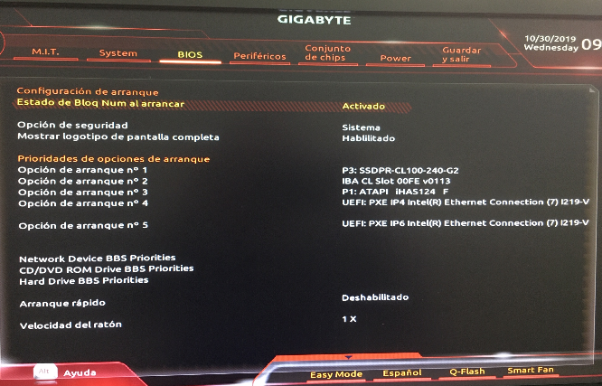
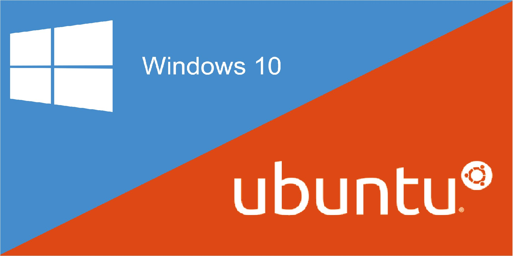
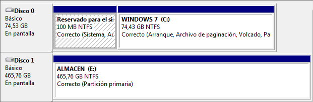

# 2.4 Instalación de sistemas operativos

En la actualidad existen tres sistemas operativos de relevancia en el mundo de la informática personal: Microsoft Windows, GNU/Linux y Apple macOS (llamado Mac OS X hasta 2016).

El más extendido de todos es Microsoft Windows, aunque GNU/Linux y macOS han avanzado bastante en los últimos años.

GNU/Linux destaca por ser un sistema libre, que puede usarse sin necesidad de pagar ninguna licencia. Además, es un sistema tipo UNIX. UNIX es un sistema operativo creado a finales de los años 60 (1969) en los laboratorios Bell, y es un referente en la historia de la informática. Además de GNU/Linux, macOS también es un heredero de UNIX.

## 2.4.1 Planificación de la instalación

La instalación de todo sistema requiere una serie de pasos, es decir, hay que definir un plan de actuación. A continuación se define el plan mediante los siguientes puntos:

* Configurar la BIOS/UEFI para arrancar desde el dispositivo donde tengamos el sistema a instalar (DVD o USB), o usar el menú de arranque del equipo. En el caso de trabajar con una máquina virtual, se carga la ISO en la unidad óptica virtual.
* Particionar adecuadamente el disco antes de la instalación, ya sea con una herramienta externa (como GParted) o con el gestor de particiones del propio instalador, que es la opción que se utilizará.
* Instalar los sistemas en el orden adecuado (para evitar sobrescrituras del gestor de arranque).
* Actualizar el sistema (actualizaciones de seguridad, parches y controladores).
* Documentar el proceso de instalación. Para ello, se hará uso de una hoja de cálculo de Google que permitirá almacenar y auditar toda la operativa del proceso de instalación.

## 2.4.2 Configuración previa de la BIOS/UEFI

La ***BIOS*** (Basic Input/Output System) es el sistema básico de entrada/salida donde se encuentran grabadas las rutinas ***POST*** (Power-On Self-Test, autocomprobación diagnóstica de encendido). Si la BIOS no encuentra nada anormal (básicamente comprueba que no falten componentes básicos como el procesador, la memoria, el teclado, etc.), intenta arrancar desde el primer dispositivo de arranque. En caso de que no pueda arrancar desde ahí, prueba desde el segundo dispositivo, y así hasta que pueda arrancar desde alguno (siguiendo el orden configurado en la BIOS). En caso de no poder arrancar desde ninguno de ellos, se muestra un mensaje de error al usuario.

En los equipos actuales, la BIOS clásica ha sido sustituida por ***UEFI*** (Unified Extensible Firmware Interface), aunque se sigue llamando "BIOS" de forma coloquial. Sus diferencias principales son:

* **Tabla de particiones:** la BIOS clásica utiliza discos **MBR** (máximo 4 particiones primarias y discos de hasta 2 TB), mientras que UEFI utiliza discos **GPT** (hasta 128 particiones y discos de mucho mayor tamaño).
* **Gestor de arranque:** en BIOS, el gestor de arranque se graba en el primer sector del disco (MBR). En UEFI, se guarda como un archivo `.efi` en una partición especial llamada **partición del sistema EFI (ESP)**, formateada en FAT32.
* **Orden de arranque:** en UEFI, el firmware guarda sus propias entradas de arranque (por ejemplo, "Windows Boot Manager" o "ubuntu"), y el orden se establece entre esas entradas.
* **Arranque seguro (Secure Boot):** UEFI puede impedir que se ejecuten cargadores de arranque que no estén firmados digitalmente. Windows 11 exige un equipo compatible con Secure Boot.
* **Modo heredado (Legacy/CSM):** muchos firmwares UEFI pueden emular una BIOS clásica para arrancar sistemas antiguos.

Es importante tener en cuenta que **todos los sistemas operativos de un equipo deben instalarse en el mismo modo** (todos en BIOS o todos en UEFI). Si se mezclan, el gestor de arranque de uno no podrá arrancar al otro.

El acceso al menú de configuración de la ***BIOS/UEFI*** es diferente en cada placa base, aunque suele ser habitual acceder a él presionando, durante el arranque, la tecla Supr, F1, F2 o F10. Muchos equipos disponen además de un **menú de arranque** (normalmente con F8, F11, F12 o Esc) que permite elegir el dispositivo de arranque una sola vez, sin cambiar la configuración.

***Figura 1.** Opciones de arranque en la BIOS.*

Una vez dentro, tendremos que buscar la ubicación del orden de arranque. En el caso de la BIOS de la Figura 1, el orden se encuentra dentro de la opción BIOS.

Debido a que los sistemas operativos suelen distribuirse en DVD o USB, es necesario cambiar el orden de arranque (o usar el menú de arranque).

La BIOS intenta arrancar siguiendo el orden indicado. Sin embargo, ese "intento" no es gratuito: lleva un tiempo. Por ello, si generalmente vamos a arrancar desde el disco duro, es recomendable establecerlo como primer dispositivo de arranque para ahorrar tiempo en el arranque del sistema operativo. Cuando haga falta arrancar desde otros dispositivos (DVD o USB), entraremos en la BIOS y cambiaremos el orden, o utilizaremos el menú de arranque.

## 2.4.3 Fases de instalación de un sistema operativo

A continuación, se enumeran las fases de la instalación de un sistema operativo:

1. Preparar el equipo para arrancar desde DVD/USB u otro soporte arrancable.
2. Preparar el disco duro.
3. Ejecutar el programa de instalación.
4. Proporcionar el nombre y la contraseña del usuario que será administrador del sistema.
5. Seleccionar los componentes software opcionales que queremos instalar.
6. Ajustar los parámetros de la red.
7. Instalar el gestor de arranque.
8. Reiniciar el sistema.
9. Realizar las actualizaciones de seguridad.
10. Instalar los drivers necesarios para los dispositivos no reconocidos en la instalación.

A continuación, se describe con detalle cada punto.

**1. Preparar el equipo para arrancar desde DVD/USB.**

Si al introducir el DVD/USB de instalación no se ejecutase el programa de instalación, habrá que modificar la configuración de la BIOS/UEFI para escoger el DVD/USB como primer dispositivo de arranque, o seleccionarlo desde el menú de arranque.

Esta operación depende del modelo de placa base del equipo, por lo que, de ser posible, consultaremos la documentación del fabricante.

**2. Preparar el disco duro.**

Esta fase consiste en crear las particiones del tipo necesario para que nuestro sistema operativo pueda instalarse.

Windows se instala sobre particiones **NTFS**, mientras que **FAT32** se utiliza para la partición del sistema EFI y para memorias USB, y **exFAT** para dispositivos extraíbles de gran capacidad. En Linux/UNIX se admiten muchos más sistemas de ficheros, siendo **ext4** el más utilizado (también existen Btrfs, XFS, etc.).

Si queremos instalar un sistema operativo en un disco donde ya haya otro sistema operativo instalado, es muy importante hacer una copia de seguridad de los datos importantes antes de proseguir con la instalación, ya que existe un alto riesgo de perderlos **TODOS** por un error durante el proceso. Una vez hecho esto, tendremos dos opciones:

* Sustituir el sistema operativo anterior.
* Instalarlo permitiendo su coexistencia y selección durante el arranque del ordenador (sistema dual o *dual boot*).

Si elegimos la primera opción, suele ser buena idea borrar en el proceso de instalación las particiones antiguas y después crear las nuevas, realizando una comprobación completa de su estado para conocer si hay errores o defectos en el disco.

En el caso de querer hacer una instalación dual, habrá que conseguir espacio suficiente para instalar el nuevo sistema operativo, normalmente restándoselo a las particiones que ya existían para el primer sistema. Esta delicada tarea suele hacerse con herramientas como GParted o con la opción "Reducir volumen" de la Administración de discos de Windows.

Por motivos de seguridad, suele ser muy interesante crear particiones independientes para guardar los datos de los usuarios (por ejemplo, una unidad D: en Windows o el directorio /home en Linux).

**3. Ejecutar el programa de instalación.**

Para ello, normalmente bastará con introducir el DVD/USB de instalación y volver a encender el equipo con él dentro. Debemos estar atentos a los primeros instantes para leer un posible mensaje que pida pulsar una tecla para iniciar la instalación (por ejemplo, "Press any key to boot from CD or DVD" en Windows). En caso contrario, bastará con esperar sin hacer nada.

**4. Proporcionar el nombre y la contraseña del usuario que será administrador del sistema.**

Todo sistema multiusuario que se precie debe tener un responsable de su funcionamiento, de su mantenimiento y de otorgar permisos de uso del equipo y de sus recursos a terceros. Es durante la fase de instalación cuando se especifica la contraseña para el mismo. En los sistemas UNIX, el nombre del administrador es siempre "root". En Windows, esta labor la lleva el primer usuario creado. En Ubuntu, la cuenta root existe pero está bloqueada por defecto, y el primer usuario creado obtiene privilegios de administración mediante el comando `sudo`.

**5. Seleccionar los componentes software opcionales que queremos instalar.**

Muchas distribuciones de sistemas operativos incluyen software adicional que puede instalarse durante la instalación del sistema. Es habitual que se nos pregunte si queremos una selección de programas recomendada o personalizada. Una vez hecho esto, comienza la copia de todos los ficheros necesarios desde el soporte de instalación al disco duro del equipo.

**6. Ajustar los parámetros de la red.**

Si nuestro equipo va a utilizarse en una red local o en Internet, habremos de configurar adecuadamente el dispositivo de comunicaciones (normalmente la tarjeta de red). Para ello, necesitaremos obtener la información pertinente del administrador de la red o del proveedor de servicios de Internet que tengamos contratado, en su caso.

Lo más común (y por tanto la opción por defecto) es que los equipos se configuren de modo que obtengan automáticamente los ajustes de red desde otro equipo que los coordina a todos, mediante un protocolo denominado DHCP (Dynamic Host Configuration Protocol). Si es así, no necesitamos hacer nada más.

En caso contrario, deberemos obtener y anotar la información correspondiente para la tarjeta de red:

* **Dirección IP:** el número que identifica a nuestro ordenador en la red para comunicarse.
* **Máscara de subred:** un número que ayuda a distinguir si las direcciones que buscamos son de nuestra red local o externas.
* **Puerta de enlace predeterminada:** la dirección IP del equipo (por ejemplo, el router) que nos da acceso a otras redes, como Internet.
* **Dirección de un servidor DNS:** la dirección del equipo que puede informarnos de la dirección IP de otro que solo conocemos por su nombre de dominio. Hace el trabajo de las "páginas blancas" de Internet.

**7. Instalar el gestor de arranque.**

Al instalar el sistema operativo, es necesario instalar un pequeño programa, el **gestor de arranque**, que permite encontrar en qué parte del disco se encuentran los distintos sistemas operativos y seleccionar uno para comenzar a trabajar al encender el equipo. Dónde se instala depende del modo de arranque:

* En equipos con **BIOS** (discos MBR), se graba en el sector de arranque del disco duro, llamado **MBR** (Master Boot Record).
* En equipos con **UEFI** (discos GPT), se guarda como un archivo dentro de la **partición del sistema EFI** y se registra como una entrada en el firmware.

En las instalaciones de Linux, el programa en cuestión suele ser **GRUB** (GRand Unified Bootloader). En Windows es el **Administrador de arranque de Windows** (Windows Boot Manager).

Windows, tras su instalación, sustituye el gestor de arranque que hubiera antes (en UEFI, se coloca el primero en el orden de arranque), y solo quedará la posibilidad de acceder a Windows. Por ello, si tenemos Linux instalado además de Windows, es muy conveniente disponer de un USB de arranque de Linux para poder reinstalar GRUB si Windows lo sobrescribe (por ejemplo, tras reinstalar Windows o tras algunas actualizaciones importantes).

Si tras instalar Linux no pudiéramos arrancar el Windows anteriormente instalado (caso poco probable), podremos restaurar su gestor de arranque desde el entorno de recuperación del medio de instalación de Windows (Reparar el equipo > Solucionar problemas > Símbolo del sistema) con la orden **bootrec /fixmbr** (en BIOS/MBR) o **bcdboot C:\Windows** (en UEFI).

Hay que asegurarse de tener antes un USB de arranque de Linux, ya que después de restaurar el gestor de arranque de Windows no se podrá volver a arrancar Linux hasta reinstalar GRUB.

**8. Reiniciar el sistema.**

Es la fase final de la instalación, y nos mostrará que el sistema está correctamente instalado.

Antes de hacerlo, debemos asegurarnos de haber retirado el DVD/USB de instalación, o volveremos a iniciar el proceso de instalación. Muchos instaladores actuales piden retirar el medio antes de reiniciar. Si aun así se inicia de nuevo la instalación, apagamos el equipo, retiramos el DVD/USB y volvemos a encenderlo.

**9. Realizar las actualizaciones de seguridad.**

Probablemente, desde que se publicó la versión de nuestro sistema operativo hasta el momento de la instalación, se han publicado correcciones que pueden aplicarse mediante un proceso de actualización a través de Internet: Windows Update en Windows, o el gestor de actualizaciones (`sudo apt update && sudo apt upgrade`) en Ubuntu. Antiguamente, cuando las correcciones eran muy numerosas, se agrupaban en discos de "Service Pack"; desde Windows 10 se distribuyen como actualizaciones acumulativas.

De no llevarlas a cabo, es muy probable que en poco tiempo tengamos problemas causados por virus, intrusos a través de la red o fallos del propio sistema operativo desconocidos en el momento de su publicación.

**10. Instalar los drivers necesarios para los dispositivos no reconocidos en la instalación.**

Es habitual que, tras instalar el sistema operativo, no funcionen aún, o no lo hagan correctamente, la impresora, el escáner, la tarjeta de sonido, la tarjeta gráfica, etc.

Para que funcionen, es necesario instalar en nuestro sistema operativo los ***drivers*** (controladores) de dichos dispositivos correspondientes a la versión de nuestro sistema operativo y, a ser posible, actualizados.

En muchos casos, el propio sistema operativo los instala, pero debido a la gran variedad de tipos de dispositivos y de fabricantes existentes en la actualidad, es imposible incluirlos todos.

Para conseguir los drivers, recurrimos al disco de instalación del dispositivo o a la página web de su fabricante (por ejemplo: HP, Epson, NVIDIA, AMD, Creative, etc.), seleccionando los de nuestro sistema operativo y su versión.

En ocasiones es necesario reiniciar el ordenador, sobre todo en entornos Windows.

## 2.4.4 Comprobación de los requisitos técnicos

El primer paso para la instalación de un equipo de escritorio será comprobar que se cumplen tanto los requisitos hardware como software. En lo relativo al hardware, los aspectos más importantes serán el procesamiento, el almacenamiento y la comunicación.

También hay que estudiar tanto la potencia necesaria como la compatibilidad con el sistema operativo y el resto de elementos que pretendemos instalar, aunque esta cuestión será mucho más determinante al referirnos al servidor o servidores.

En ocasiones, dispondremos de un equipamiento previo sobre el que, en el mejor de los casos, podremos realizar ciertas modificaciones o actualizaciones. En estos casos, deberemos ajustar las características de nuestra implantación a los recursos existentes. En otras situaciones, tendremos libertad para diseñar todos los aspectos de nuestra instalación, adquiriendo el material necesario para ponerla en práctica. Sea cual sea la situación que se produzca, determinará en gran medida el resto de las decisiones que tomemos.

Por lo tanto, algunas de las preguntas que deberemos hacernos son las siguientes:

* ¿Qué sistema operativo me ofrecerá mejor rendimiento en un equipo de escritorio? La mayoría de las veces, los ordenadores del lado cliente serán los que tengan una capacidad de cálculo más ajustada y, además, son los que más tardan en actualizarse o sustituirse dentro de la estructura de una empresa. Por ejemplo, dado un determinado ordenador, deberemos averiguar si un sistema operativo tendrá un mejor comportamiento que otro. Para ello, podremos comprobar sus requisitos mínimos y recomendados.
* ¿Los sistemas operativos elegidos soportan todo el *hardware* necesario? ¿Disponen de los *drivers* adecuados? Es muy frecuente que algunos sistemas operativos, sobre todo los de software libre, no dispongan de todos los *drivers* necesarios para todos los modelos de impresoras, escáneres u otros dispositivos que podamos necesitar en el presente o en el futuro. Por esto, la elección del sistema operativo puede verse condicionada por los dispositivos que ya tenemos o, al contrario, la adquisición de nuevos dispositivos estará supeditada al sistema operativo por el que nos hayamos decantado.
* ¿Los costes derivados del diseño son asumibles para la empresa? Un error común es sobredimensionar todo el diseño para asegurarnos de que cumple con todas las necesidades presentes y futuras, pero esto nos puede llevar a plantear un coste excesivo. Por este motivo, debemos hacer el estudio con el máximo rigor y ofrecer un resultado ajustado a las necesidades reales.

### Actividad 1. Tabla de requisitos mínimos y comparativa

La actividad trata de que se realice una tabla comparativa con los requisitos mínimos de Windows 10, Windows 11 y Ubuntu Desktop 22.04.1 LTS en sus versiones de 64 bits. Además, tendrás que describir las ventajas y desventajas que presentan Windows y Ubuntu Desktop uno respecto al otro. Respecto a los componentes con requisitos mínimos y recomendados, se propone buscar los siguientes:

* Procesador mínimo.
* Procesador recomendado.
* Memoria RAM mínima y recomendada.
* N.º de procesadores/núcleos.
* Espacio en disco mínimo y recomendado.
* Tarjeta gráfica mínima y recomendada.
* Unidad DVD.
* Etcétera.

Por último, tendrás que realizar una comparativa más exhaustiva entre Windows 11 64 bits y Ubuntu Desktop 22.04.1 LTS 64 bits.

**Windows vs Ubuntu.**

## 2.4.5 Instalación de Windows

### 1. Introducción

La instalación de ***Windows*** es bastante sencilla. Lo primero que hay que tener en cuenta es que ***Windows 7, 8, 10 y 11*** solo pueden instalarse sobre ***sistemas de ficheros NTFS***. Dichas particiones pueden crearse y formatearse a través del propio instalador de Windows, o bien con anterioridad haciendo uso de alguna de las herramientas ya vistas. El resto del proceso es totalmente guiado y muy fácil (se verá en las prácticas).

Además, ***Windows 11*** exige un equipo con ***UEFI compatible con Secure Boot, disco GPT y chip TPM 2.0***, por lo que no puede instalarse en modo BIOS/MBR.

Sin embargo, hay un detalle importante a tener en cuenta. ***Windows***, después de su instalación, ***sobrescribe siempre el gestor de arranque*** ***con la información necesaria para que el siguiente arranque se haga desde la partición donde acaba de instalarse Windows***. En caso de detectar más de un sistema operativo Windows, el instalador añade un menú de arranque (parecido al de GRUB) que puede gestionarse desde el último Windows instalado.

No obstante, hay que tener en cuenta que el instalador de Windows solo "ve" aquellos sistemas Windows cuya versión sea igual o inferior a la que se está instalando.

Si se quiere instalar Windows 7 y Windows 8, es importante instalar primero Windows 7 y luego Windows 8. En caso de hacerlo al contrario, Windows 7 no "vería" el sistema Windows 8 y sobrescribiría el sector de arranque sin insertar un menú, perdiendo el acceso a dicho sistema. Por el mismo motivo, si se instalan Windows 10 y Windows 11, se instalará primero Windows 10 y después Windows 11 (ambos en modo UEFI).

Para instalar Windows 10/11, simplemente hay que tener en cuenta los siguientes aspectos:

* Número de particiones a usar (las que crea el sistema, la raíz, etc.).
* Datos del usuario (nombre, usuario y contraseña).

El resto de aspectos los puedes visualizar en el siguiente vídeo, donde se describe el proceso completo de la instalación de Windows 10. El vídeo no contempla todo el proceso, es decir, se han realizado pausas en momentos como la copia masiva de ficheros, la descarga de ficheros, etc.; todo lo relacionado con el progreso de acciones donde no hay interacción con el usuario.

[▶ Ver vídeo: Instalación de Windows 10](https://www.youtube.com/watch?v=LdhX7PLBlIk)

***Vídeo 1.** Instalación de Windows 10.*

### **2. Partición reservada de Windows**

Cuando instalamos Windows en modo **BIOS (disco MBR)**, ***si el proceso detecta espacio sin asignar*** en lugar de una partición, se genera de forma automática una partición reservada para los ficheros de arranque del sistema, de **100 MB** en Windows 7, **350 MB** en Windows 8 y **500 MB** en Windows 10, que se marcará como partición activa (esta es la opción que recomienda Microsoft). Además, Windows 10 crea una pequeña partición de recuperación.

Sin embargo, ***si se instala sobre una partición ya existente***, no se crea la partición reservada. En ese caso, la instalación almacena en la partición seleccionada tanto los ficheros de arranque como el resto de archivos del sistema operativo.

Cuando se instala en modo **UEFI (disco GPT)**, como ocurre obligatoriamente en Windows 11, Windows crea estas particiones:

* **Partición del sistema EFI** (unos 100 MB, FAT32): contiene los ficheros de arranque.
* **Partición reservada de Microsoft (MSR)** (16 MB): no es visible y no tiene sistema de ficheros.
* **Partición principal de Windows** (NTFS): la unidad C:.
* **Partición de recuperación** (unos 500-800 MB, NTFS): contiene el entorno de recuperación de Windows (WinRE).

#### **2.1 Características**

La partición reservada para el sistema de ***100 MB en Windows 7*** o ***500 MB en Windows 10*** es una partición oculta que crea de forma automática Windows 7/8/10 en modo BIOS, y que tiene ciertas características o funciones que hay que conocer:

* Permite el uso de [**BitLocker**](https://technet.microsoft.com/es-es/library/dd835565(v=ws.10).aspx) (ver nota) con la partición del sistema.
* Permite crear un entorno aislado desde donde lanzar la recuperación del sistema, aunque esto último, salvo daño grave del sistema operativo, también se puede hacer sin necesidad de tener esa partición oculta, desde el DVD/USB de instalación o empleando software externo. En Windows 7 se accedía pulsando F8 durante el arranque; desde Windows 8, se accede manteniendo pulsada la tecla Mayús al elegir "Reiniciar", o de forma automática tras varios arranques fallidos.
* Además, contiene los ficheros de arranque de Windows (bootmgr, \Boot, etc.), que en versiones anteriores a Windows 7 se ubicaban en la raíz de la unidad del sistema.

***Figura 2.** Partición reservada.*

**Nota:** **BitLocker** permite mantener a salvo todo, desde documentos hasta contraseñas, ya que cifra toda la unidad en la que residen Windows y sus datos. Una vez que se activa **BitLocker**, se cifran automáticamente todos los archivos almacenados en la unidad. Está disponible en las ediciones Pro, Enterprise y Education.

#### **2.2 Evitar la partición reservada**

Estas técnicas solo son aplicables a instalaciones en modo **BIOS/MBR**. En modo UEFI/GPT, la partición del sistema EFI es imprescindible para arrancar y no debe eliminarse.

Tenemos varias formas de evitar que se cree la partición reservada:

* Si el disco duro está sin particionar y el particionado se hace desde el instalador de **Windows 10**, la partición se crea de manera automática. Pero si el disco duro se particiona antes de la instalación (por ejemplo, con GParted o Acronis) y no se modifica nada desde el instalador, salvo formatear la partición en NTFS (operación que sí es recomendable hacer desde el instalador del sistema), la partición reservada no se crea y **Windows 10** se instala en alguna de las particiones que ya estaban creadas.
* Otra manera sería, desde el propio proceso de instalación, al llegar a la pantalla de particiones, hacer clic en ***"Opciones de unidad (avanzadas)"*** para eliminar las particiones existentes y crear una nueva partición. Al hacerlo, veremos en pantalla el mensaje siguiente: *"Para garantizar que todas las características de Windows funcionen correctamente, Windows puede crear particiones adicionales para los archivos de sistema."* A continuación se habrán creado varias particiones: la partición reservada del sistema (100 MB en Windows 7, 350 MB en Windows 8, 500 MB en Windows 10) y la principal. El proceso consistiría en eliminar la principal (que pasará a ser espacio no asignado) y extender la partición reservada del sistema de acuerdo con el espacio libre del que dispongamos. Por último, se le da formato y, una vez finalizado, la partición reservada original se habrá transformado en una partición del sistema normal.

#### **2.3 Ventajas y desventajas de separar las particiones de arranque y de sistema**

**Ventajas**

* Tener una partición separada para los ficheros de arranque es beneficioso, puesto que facilita la instalación de múltiples sistemas operativos de la familia Windows.
* Algunos virus y malware (aunque cada vez menos) suponen que el sistema operativo reside en la unidad C:. Al tener los archivos de arranque en otra partición, el código del virus fallará.
* Ciertas herramientas relacionadas con el almacenamiento, como **BitLocker**, requieren una configuración de particiones en la que la partición de arranque esté separada de la del sistema para poder cifrar correctamente el contenido de un volumen.

**Inconvenientes**

* Si se desea crear una imagen del sistema operativo para poder restaurarla, será necesario hacer también una imagen de la partición reservada, puesto que, al contener el arranque, también es susceptible de dañarse. Este tipo de imágenes es muy habitual en configuraciones donde el usuario separa los datos del sistema en particiones distintas.
* Si se quiere hacer un arranque multisistema con gestores de arranque de terceros (no con el que incorpora el propio Windows, que no se lleva bien con otros sistemas operativos que no sean de Microsoft), como el antiguo GRUB (GRUB Legacy), puede que el sistema no arranque al no ser capaz de gestionar la partición reservada. A partir de **GRUB 2** ya es posible hacer un arranque multisistema (Linux-Windows) con esa partición reservada sin problemas.

#### 2.4 Conclusiones

Aunque Microsoft recomienda dejar que Windows gestione la partición reservada, podemos deducir que, en instalaciones en modo BIOS/MBR, si no es necesario el uso de BitLocker con la partición de Windows, puede evitarse su creación. En modo UEFI/GPT, las particiones que crea Windows son necesarias y no deben eliminarse.

Para finalizar, se muestran algunos escenarios de posibles errores durante la instalación de Windows.

**Escenario 1.** Se instala **Windows 10 64 bits** y la instalación lanza un mensaje diciendo que *"No se puede instalar Windows en este disco. El disco seleccionado tiene el estilo de partición GPT"*.

* ***Causa:*** el instalador se ha arrancado en modo BIOS (Legacy), pero el disco tiene tabla de particiones GPT, que requiere modo UEFI.
* ***Solución recomendada:*** arrancar el instalador en modo UEFI (desde el menú de arranque, eligiendo la entrada "UEFI: ..." del DVD/USB). Así se podrá instalar sobre el disco GPT sin borrar nada.
* ***Solución alternativa (borra todo el disco):*** en la ventana de selección de discos, pulsar **Mayús+F10** para abrir la consola del sistema e introducir los siguientes comandos:
  + diskpart
  + list disk
  + select disk 0
  + clean
  + exit

El comando **diskpart** abre la herramienta de gestión de discos; **list disk** muestra los discos para comprobar cuál es el correcto; **select disk 0** selecciona el disco; **clean** elimina todas las particiones y su contenido; y **exit** sale de la herramienta. Después se cierra la consola y se pulsa "Actualizar" para continuar la instalación. Hay que tener en cuenta que **se perderán todos los datos del disco**.

**Escenario 2.** Comienza la instalación de **Windows 10** pero, al terminar, aparece un mensaje que indica que Windows no puede actualizar la configuración de arranque del equipo.

* **Solución:** el firmware UEFI puede proteger el arranque del sistema impidiendo que se hagan modificaciones. Una posible solución es entrar en la configuración UEFI y desactivar temporalmente el arranque seguro (Secure Boot). También conviene comprobar que el instalador se ha arrancado en el mismo modo (UEFI o Legacy) que corresponde al disco. Una vez instalado, se recomienda volver a activar Secure Boot.

## 2.4.6 Instalación de GNU/Linux

### 1. Instalación de Ubuntu

No es estrictamente necesario instalar una distribución Linux para comenzar a utilizarla. Por ejemplo, Ubuntu (la distribución con la que se va a trabajar) puede descargarse en versión Live (DVD o USB), es decir, es posible arrancar el sistema operativo directamente desde el lector óptico o el USB y comenzar a trabajar con él. Sin embargo, aunque esta opción puede ser interesante para probar Linux (o para intentar rescatar un sistema), no es la más recomendable para un uso continuado, ya que el arranque desde un medio óptico o USB es lento y, además, los cambios y datos no se conservan salvo que se utilice otra unidad para almacenarlos.

La instalación de Linux es un poco más compleja que la de Windows (aunque no mucho más). Hay que tener en cuenta que Linux trabaja con sistemas de ficheros ext2, ext3 y ext4 (entre otros). Actualmente, **ext4** es el sistema de ficheros recomendado y el que utiliza Ubuntu por defecto. Si se desea acceder a los datos desde Windows, hay que tener en cuenta lo siguiente:

* Windows no puede leer particiones ext4 de forma nativa. Para acceder a ellas, se puede utilizar WSL2 (Subsistema de Windows para Linux, con la orden `wsl --mount`) o programas de terceros que permiten leer estas particiones y copiar los datos que se necesiten.
* En cambio, Linux sí puede leer y escribir particiones NTFS. Por ello, si se quieren compartir datos entre ambos sistemas, lo más práctico es crear una partición de datos en NTFS o exFAT accesible desde los dos. Para que Linux pueda montar la partición de Windows, Windows debe estar completamente apagado (con el inicio rápido y la hibernación desactivados).
* Para crear imágenes de disco una vez instalados y configurados todos los sistemas operativos, pueden utilizarse herramientas como **Clonezilla**, compatibles con ext4 y NTFS (el volcado de una imagen sobre un disco puede costar solo 15 o 20 minutos).

Otro tema a tener en cuenta es el espacio de intercambio (**swap**), que el sistema utiliza cuando la memoria RAM se llena. Puede ser una partición especial (Linux-Swap) o un archivo; desde la versión 17.04, Ubuntu utiliza por defecto un **archivo de intercambio** (swapfile), por lo que no es obligatorio crear una partición. Los criterios para decidir su tamaño se explican en el apartado 2 de esta sección.

Al igual que Windows, una vez finalizada la instalación, Linux instala su gestor de arranque, GRUB (en el MBR en modo BIOS, o en la partición del sistema EFI en modo UEFI). Sin embargo, Linux es más "flexible": GRUB no solo busca otros sistemas Linux instalados en el equipo, sino que también busca sistemas Windows, y los añade a su menú para que el usuario decida qué sistema operativo desea arrancar. Esta búsqueda la realiza la herramienta **os-prober**. En las versiones recientes de GRUB (2.06 en adelante) puede venir desactivada, y en ese caso hay que activarla añadiendo la línea `GRUB_DISABLE_OS_PROBER=false` al archivo `/etc/default/grub` y ejecutando `sudo update-grub`.

Debido a lo anterior, es interesante pensar cuántos sistemas se quieren instalar en un mismo equipo para elegir el orden adecuado de instalación: primero los sistemas Windows, del más antiguo al más moderno, y en último lugar Linux. Por ejemplo, si se quiere instalar Ubuntu, Windows 10 y Windows 11, el orden deberá ser el siguiente (todos en modo UEFI, ya que Windows 11 lo exige):

1. Windows 10.
2. Windows 11.
3. Ubuntu.

Para instalar [Ubuntu 22.04 LTS (Jammy Jellyfish)](https://releases.ubuntu.com/22.04/), o una versión LTS más reciente, simplemente hay que tener en cuenta los siguientes aspectos:

* Número de particiones a usar: partición raíz (/), partición del sistema EFI en modo UEFI y, de forma opcional, /home y swap.
* Datos del usuario (nombre, usuario y contraseña).

El resto de aspectos los puedes visualizar en el siguiente vídeo, donde se describe el proceso completo de la instalación de Ubuntu Server (el proceso de Ubuntu Desktop es similar, pero con instalador gráfico). El vídeo no contempla todo el proceso, es decir, se han realizado pausas en momentos como la copia masiva de ficheros, la descarga de ficheros, etcétera; todo lo relacionado con el progreso de acciones donde no hay interacción con el usuario.

[▶ Ver vídeo: Instalación de Ubuntu 20.04 LTS Server](https://www.youtube.com/watch?v=QEl11yiBSWY)

***Vídeo 2.** Instalación de Ubuntu 20.04 LTS Server.*

### 2. Partición swap en Linux

En los equipos actuales (con 16 GB de RAM o más), una distribución Linux con un uso normal puede funcionar sin inconvenientes sin espacio swap. Pero hay ocasiones en las que tenerlo es imprescindible, y siempre es recomendable.

Podemos establecer unos criterios para saber si necesitamos crear espacio swap en un sistema GNU/Linux (en Windows, el equivalente es el archivo de paginación, `pagefile.sys`, que el sistema gestiona automáticamente).

Se considera necesario disponer de swap en estos casos:

1. Si el equipo tiene 4 GB de RAM o menos. Aunque ya casi no quedan ordenadores de escritorio o portátiles con esta cantidad de RAM, sí es común en equipos diseñados originalmente para trabajar con la nube.
2. Cuando se utilicen aplicaciones que necesitan mucha memoria RAM, como los editores de vídeo.
3. En caso de que deseemos habilitar el modo **hibernación** en nuestro equipo.

Incluso cuando se tiene memoria RAM suficiente (más de 8 o 16 GB, dependiendo del tipo de aplicaciones que se utilicen), es conveniente disponer de algo de espacio swap. Esto servirá para evitar que un programa con mal funcionamiento consuma más memoria de la necesaria y bloquee el sistema. Por ejemplo, en 2017 usuarios de GNOME 3.26 informaron de que el consumo de memoria aumentaba de forma desmedida al cambiar entre ventanas o acceder al menú (actualmente el problema está corregido).

#### 2.1. Formas de determinar el tamaño adecuado de la partición swap

No hay un criterio uniforme a la hora de determinar cuánto espacio de disco asignar a la swap, aunque podemos aplicar los siguientes criterios, basados en las recomendaciones de Ubuntu:

* Si la memoria RAM es de 1 GB o menos, la swap debe ser como mínimo igual a la RAM y como máximo el doble.
* Si la memoria RAM es mayor de 1 GB, la swap debe ser como mínimo la raíz cuadrada del tamaño de la RAM (redondeada) y como máximo el doble de la RAM. Por ejemplo, con 16 GB de RAM, al menos 4 GB de swap.
* Para utilizar sin problemas el modo hibernación, el tamaño de la swap debe ser igual al tamaño de la RAM más la raíz cuadrada del tamaño de la RAM. Por ejemplo, con 16 GB de RAM, 20 GB de swap.

No hay ninguna combinación de hardware y software igual a otra. Lo mejor es probar diferentes tamaños para encontrar el que funcione mejor con nuestra RAM y nuestras aplicaciones.
