# 2.5 Instalación de múltiples sistemas operativos


Aunque lo más normal en un sistema informático es utilizar únicamente un sistema operativo, cada vez, son más los usuarios que optan por instalar dos o más sistemas operativos en su ordenador con diferentes fines según cada uno.

Como la arquitectura informática actual está desarrollada para arrancar un sistema operativo a la vez debemos instalar un software que nos permita elegir qué sistema operativo queremos arrancar cada vez que encendamos el equipo. Ejemplos:

* Probar un nuevo Sistema Operativo en el PC sin quitar el que estamos utilizando, por ejemplo Windows 7 de 32 y 64 bits, Windows 10 y Ubuntu, etc.
* Empresas de desarrollo de software que realizan pruebas de sus productos sobre los diferentes sistemas operativos.
* Utilizar una herramienta software que solo funciona bajo un Sistema Operativo determinado.

Este tipo de pruebas se pueden realizar mediante el uso de máquinas virtuales pero debido a las técnicas de emulación y virtualización utilizadas no llega a ser una prueba 100% fiable y podemos encontrarnos con sorpresas desagradables cuando trabajemos con la máquina real. Nosotros vamos a centrarnos en 3 grupos de sistemas operativos:

* Familias Microsoft 7 y 10.
* Familia Linux, en concreto la distribución Ubuntu y RedHat.

Esta clasificación se ha realizado en función del sistema de arranque de las distintas familias.

En este capítulo, se analizan las principales opciones que se tienen para configurar en el sistema un arranque dual donde elegir el sistema que se desea cargar al arrancar el PC.

## 2.5.1 Orden de instalación

Por regla general, el orden de instalación de los diferentes sistemas operativos debe ser el siguiente:

1. Sistemas operativos de Microsoft antiguos.
2. Sistemas operativos de Microsoft nuevos.
3. Distribuciones Linux.

Si no seguimos este orden, las instalaciones de los sistemas operativos machacaran el arranque de los anteriores, por lo que no tendremos acceso a iniciar dichos sistema. Esto se ha explicado anteriormente. Por ejemplo, si queremos instalar Windows 7, Windows 8 y Ubuntu, tenemos las siguientes posibilidades:

|  |  |  |  |
| --- | --- | --- | --- |
| **Opciones** | **1ª Instalación** | **2ª Instalación** | **3ª Instalación** |
| **A** | Windows 7 | Windows 10 | Ubuntu |
|  |  |  |  |
| --- | --- | --- | --- |
| **B** | Windows 7 | Ubuntu | Windows 10 |
|  |  |  |  |
| --- | --- | --- | --- |
| **C** | Windows 10 | Windows 7 | Ubuntu |
|  |  |  |  |
| --- | --- | --- | --- |
| **D** | Windows 10 | Ubuntu | Windows 7 |
|  |  |  |  |
| --- | --- | --- | --- |
| **E** | Ubuntu | Windows 7 | Windows 10 |
|  |  |  |  |
| --- | --- | --- | --- |
| **F** | Ubuntu | Windows 10 | Windows 7 |

De todas estas opciones, la **A** sería la correcta, mientras que la **F** sería la que más complicaciones nos acarrearía, ya que el Windows 10 machacaría el arranque de Ubuntu y el Windows 7 machacaría el del Windows 8.

## 2.5.2 Personalización del menú de arranque

### 1. Introducción

Una vez tenemos instalados los diversos sistemas operativos, al iniciar el PC nos aparecerá un menú proporcionado por los gestores de arranque con los diferentes sistemas operativos. Dichos menús se pueden personalizar y adaptar a las preferencias de los usuarios.

Hay que tener en cuenta que el gestor de arranque que habrá que manipular será el del último Sistema Operativo Instalado. Normalmente se suele modificar el orden en el que aparecen, el que arrancará por defecto y el tiempo de espera predeterminado para que el usuario elija una opción.

### 2. Gestores de arranque de Windows

Por lo general, Windows instala uno de los gestores de arranque en nuestro sistema, sin embargo, cuando únicamente tenemos un sistema operativo instalado este gestor no aparece en el arranque cargando automáticamente el sistema.

Si vamos a instalar varios sistemas operativos ***Windows*** (por ejemplo Windows 10 y Windows 11) podemos aprovechar perfectamente uno de los gestores de arranque de Windows para poder elegir el sistema operativo que queremos arrancar por defecto en el arranque del sistema.

Su instalación y configuración es muy sencilla, lo único que debemos hacer es asegurarnos de instalar en primer lugar el sistema operativo más antiguo (Windows 10 en este caso) y a continuación el más reciente (Windows 11) para que haya total compatibilidad entre ellos.

Al instalar ***Windows 10/11*** el proceso de instalación detectará una partición previa con ***Windows 10*** y automáticamente añadirá una entrada al gestor de arranque de manera que al arrancar el sistema podremos elegir el que queremos cargar y utilizar.

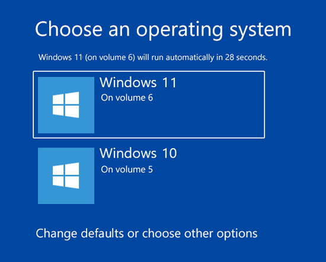

***Figura 6.2.1** Menú de arranque en Windows.*

En los siguientes puntos, se describen diversos métodos para definir con cuál Sistema Operativo iniciará por defecto el sistema.

#### **2.1. Cómo definir el Sistema Operativo en la configuración del sistema Windows 10.**

* **Paso 1.** Para realizar el cambio usando este proceso accederemos a la configuración del sistema y para ello contamos con dos opciones:  
  + En el cuadro de búsqueda de Windows 10 ingresamos el termino**msconfig** y seleccionamos la opción **Configuración del sistema.**
  + Usando el comando Ejecutar ( **+** **R**) e ingresar **msconfig**, pulsamos **Enter** o **Aceptar**.
* **Paso 2.**En la ventana desplegada vamos a la ficha **Arranque** y allí seleccionamos el nuevo sistema operativo que deseamos sea el predefinido y pulsamos en Aplicar:

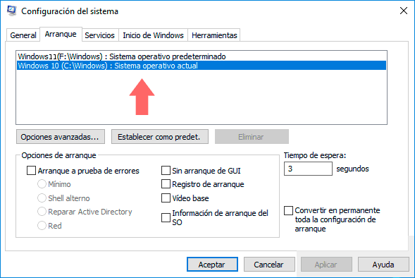

***Figura 2.** Menú de arranque en Windows.*

* **Paso 3.** Pulsamos en **Aceptar** y se desplegará la siguiente ventana. Allí pulsamos en **Reiniciar** para aplicar los cambios.

[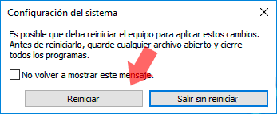](https://www.solvetic.com/uploads/monthly_04_2017/tutorials-9832-0-51563100-1491927927.png "3-reinicar-sistema.png - Tamaño: 5,17K")

***Figura 3.** Reiniciar el sistema.*

Es importante anotar que desde esta opción podemos definir parámetros adicionales como el tiempo que estarán disponibles los sistemas operativos en el inicio, establecer el tipo de arranque, etcétera.

#### 2.2. Cómo configurar el Sistema Operativo predefinido usando Inicio y recuperación Windows 10

Esta es otra de las opciones disponibles en Windows para configurar el sistema operativo predefinido.

**Paso 1.** Para acceder a Inicio y recuperación, se tienen las siguientes alternativas:

* A través de Ejecutar e ingresando **sysdm.cpl** y pulsando Enter.
* Usando la ruta**Panel de control\ Sistema y seguridad\ Sistema** y allí elegir la opción **Configuración avanzada del sistema.**

**Paso 2.** En la ventana desplegada vamos a la pestaña **Opciones avanzadas:**

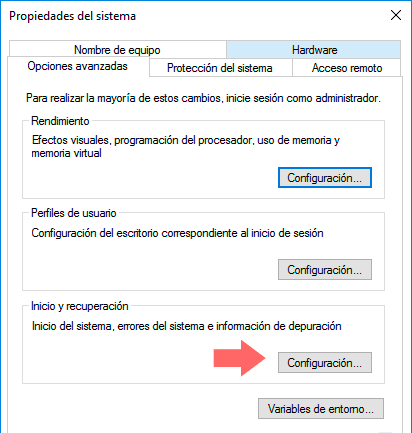

***Figura 4** Propiedades del sistema.*

**Paso 3.** A continuación, hay que pulsar el botón ***Configuración*** ubicado en el campo ***Inicio y recuperación*** y veremos la siguiente ventana donde hay que definir el sistema operativo predeterminado desplegando las respectivas opciones. De la misma forma, es posible establecer determinadas configuraciones del arranque. Una vez definido pulsamos en Aceptar.

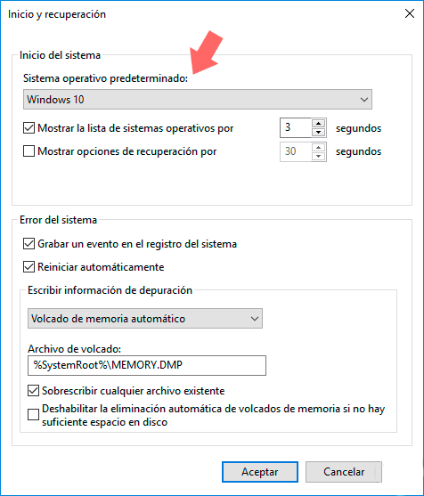

***Figura 5.** Inicio y recuperación*.

#### **2.3.** Cómo configurar el Sistema Operativo predefinido usando el arranque de Windows 10

**Paso 1.**Para realizar este proceso, se ha de reiniciar el sistema en modo avanzado pulsando la tecla Shift y presionando Reiniciar, accederemos a la siguiente ventana:

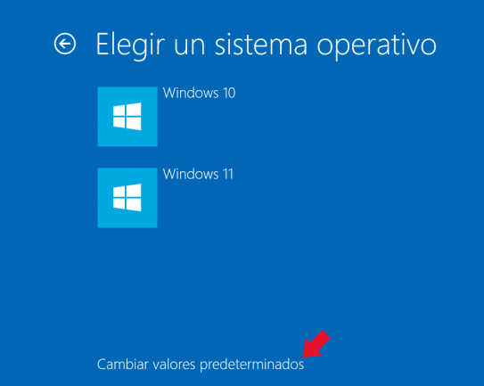

***Figura 6.** Elegir sistema operativo.*

**Paso 2.**Allí se selecciona la opción **Usar otro sistema operativo** y veremos la siguiente ventana donde elegimos la opción **Cambiar valores predeterminados**:

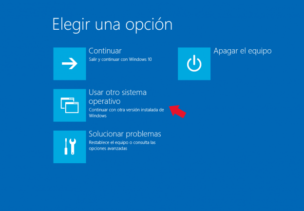

***Figura 7.** Elegir una opción.*

**Paso 3.** Se desplegará lo siguiente:

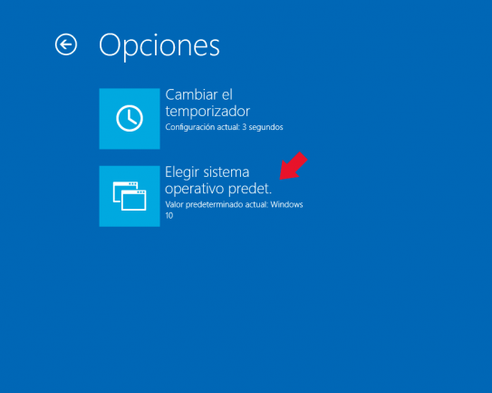

***Figura 8.**Opciones.*

**Paso 4.**Allí pulsamos en la opción **Elegir sistema operativo predeterminado**. Para definir cuál será el sistema operativo por defecto. Allí pulsamos en la opción deseada y de esta forma ese será el sistema por defecto.

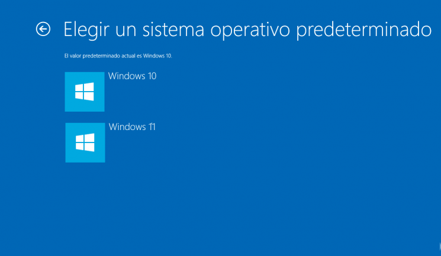

***Figura 9.**Elegir sistema operativo predeterminado.*

### 2. Gestores de arranque LINUX - Ubuntu

Linux no cuenta con un gestor de arranque propio, sino que permite usar cualquier gestor de arranque que deseemos. El que se suele incluir actualmente en todas las versiones de Linux es el **GRUB**. El GRand Unified Bootloader (GRUB) es un gestor de arranque múltiple que se usa comúnmente para iniciar dos o más sistemas operativos instalados en un mismo ordenador. Otros gestores de arranque usados anteriormente en Linux son el syslinux y el lilo.

El gestor de arranque **GRUB** (GRand Unifier Bootloader) viene preinstalado en la mayoría de las distribuciones de GNU/Linux modernas, entre ellas Debian, Ubuntu y sus derivadas.

En la actualidad nos podemos encontrar con GRUB en sus versiones 1 y 2, que son algo distintas.

A partir de la Ubuntu 9.10, se tiene disponible el **GRUB2**, que incorpora las siguientes mejoras:

* **Modo de rescate:** permite acceder a una interfaz de comandos sin necesidad de reiniciar en caso de que sea imposible iniciar el sistema con la configuración existente.
* **Inicio gráfico:** La primera generación de GRUB permite poner un fondo de pantalla a un menu de selección basado en texto. GRUB 2 es completamente gráfico. Hasta ahora se sabe que Ubuntu no incluirá un menú gráfico por omisión, pero no tardarán en aparecer los artistas de siempre.
* **Iniciar desde una imagen ISO:** Permite iniciar el sistema desde una imagen ISO guardada en el disco. Con esta característica ya no será necesario grabar un CD/DVD o utilizar un disco USB para iniciar otro sistema operativo. Sólo bastará con guardar el archivo ISO en el disco duro y decirle a GRUB que inicie desde allí.
* **Scripting:** GRUB 2 no sólo interpretará lineas de configuración de inicio, sino que también podrá ejecutar sencillos scripts.

Para modificar el contenido del menú de arranque del GRUB es necesario que se arranque el sistema Linux (en nuestro caso, Ubuntu). Una vez dentro se puede cambiar el orden de arranque de manera gráfica o manualmente:

***A) Manualmente***

**GRUB2**

El menú del GRUB puede modificarse también de manera manual ya que el contenido está escrito en el fichero de texto /boot/grub/grub.cfg aunque para editarlo necesitaremos permisos de administrador. Una vez abierta una consola (*Aplicaciones → Accesorios → Terminal*), la lista de comandos a ejecutar es la siguiente:

1. cd /boot/grub (accedemos a la carpeta).
2. cp **grub.cfg** grub.cfg.bak (hacemos una copia de seguridad del fichero de configuración de grub).
3. sudo nano ****grub**.**cfg**** (abrimos el fichero grub.cfg con el editor de textos *nano* y con permisos de administración).
4. Se nos pedirá la contraseña y luego se abrirá el editor de texto.

***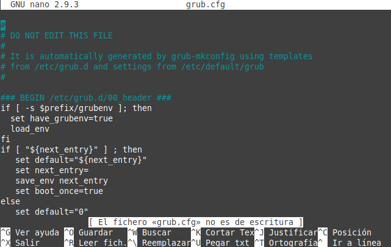***

***Figura 10.** Fichero grub.cfg.*

La parte que nos interesa es la línea que pone ***default 0*****:**

La opción ***timeout*** indica cuántos segundos deben pasar para que se arranque el sistema por defecto.

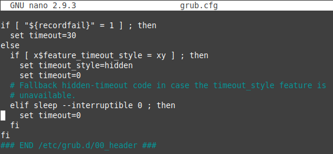

En cambio, **default 0** significa que el sistema operativo que se a arrancar es el primero indicado en la lista del final del documento (la numeración empieza en 0).

Si queremos arrancar por defecto Windows, sólo tenemos que contar todas las entradas del menú en las que pone **menuentry** y cambiar el valor de default dicho número:

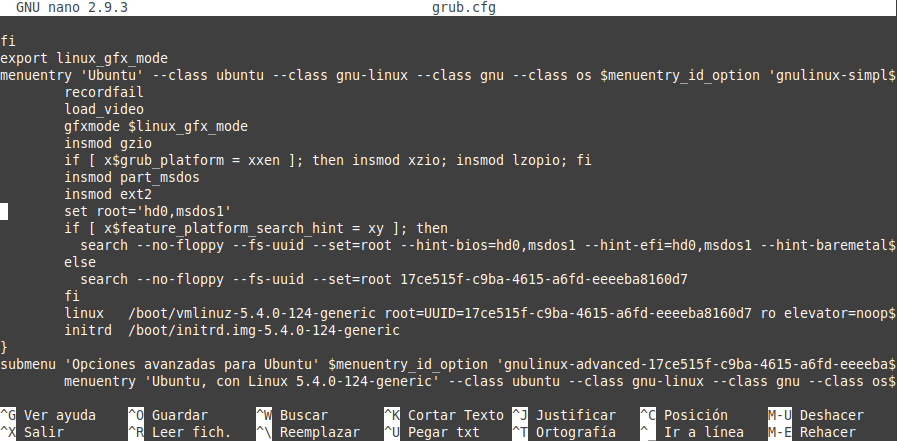

Otra forma de hacerlo sin tener que abrir el fichero ***grub.cfg***, es usando el comando grep, es decir, como primero debemos saber qué opciones tenemos, para ello en una terminal escribamos lo siguiente:

```
jc@jc-Latitude-E6430:~$grep menuentry /boot/grub/grub.cfg
```

Nos aparecerán nuestras opciones, algo así:

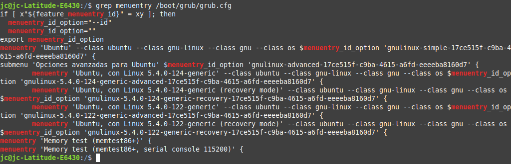

***Figura 11.** Entradas en grub.*

Como se puede observar, cada línea que empiece con “**menuentry**” es una opción. Cuando tenemos el número de entrada que deseamos establecer por defecto en el arranque, debemos editar otro archivo, en este caso debemos editar: **/etc/default/grub**. Para ello en una terminal escribamos lo siguiente:

```
jc@jc-Latitude-E6430:/$sudo nano /etc/default/grub
```

**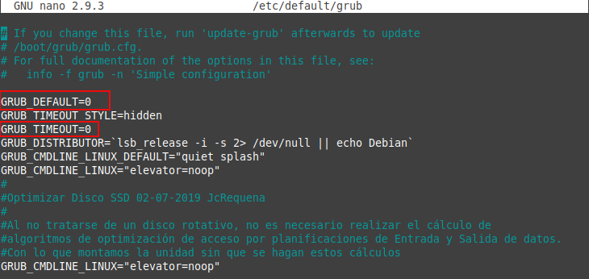**

***Figura 12.** Contenido del fichero grub en /etc/default.*

Como pueden ver en la imagen, se encuadra en rojo **GRUB\_DEFAULT=0** que es la línea que indica la opción por la cual se accederá por default. O sea, supongamos que yo deseo que mi PC siempre entre por defecto por la tercera entrada (menuentry) entonces esa línea debería quedar: GRUB\_DEFAULT=2

Además en la línea siguiente dice: **GRUB\_TIMEOUT=0**, esto se refiere al tiempo de espera, los segundos que Grub2 esperará antes de abrir la opción por defecto, o sea, son los segundos que tienen para usando las teclas de dirección Arriba y Abajo cambiar la opción por la que se accederá. Para este caso, 0 segundos indica que entre automáticamente sin esperar.

Una vez cambiado esto, simplemente nos queda ejecutar en la terminal:

```
jc@jc-Latitude-E6430:/$sudo update-grub
```

Esto actualizará los cambios y los hará efectivos.

